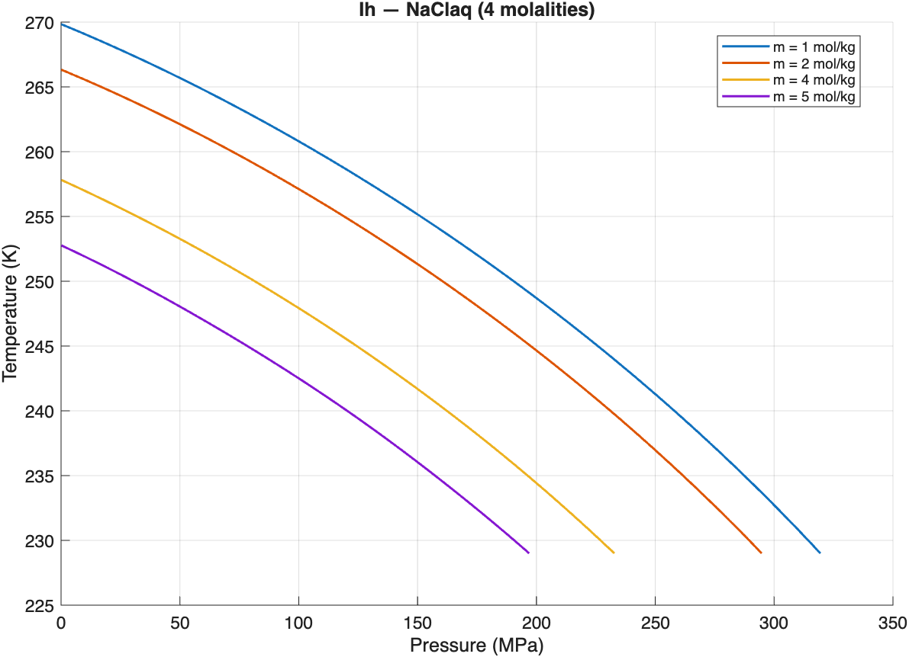
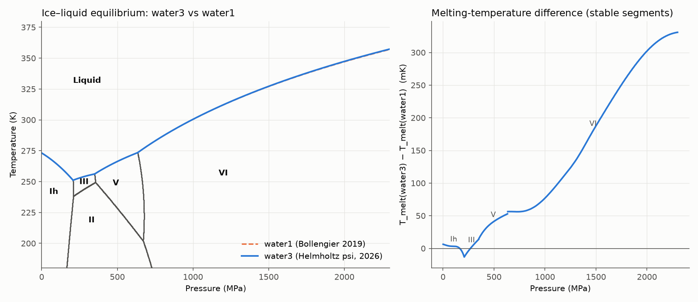
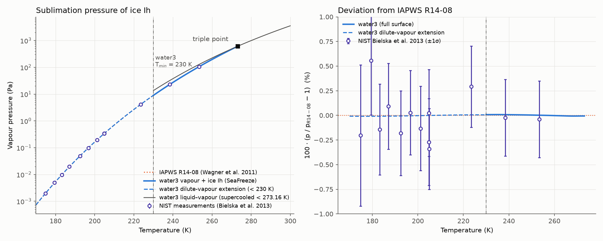
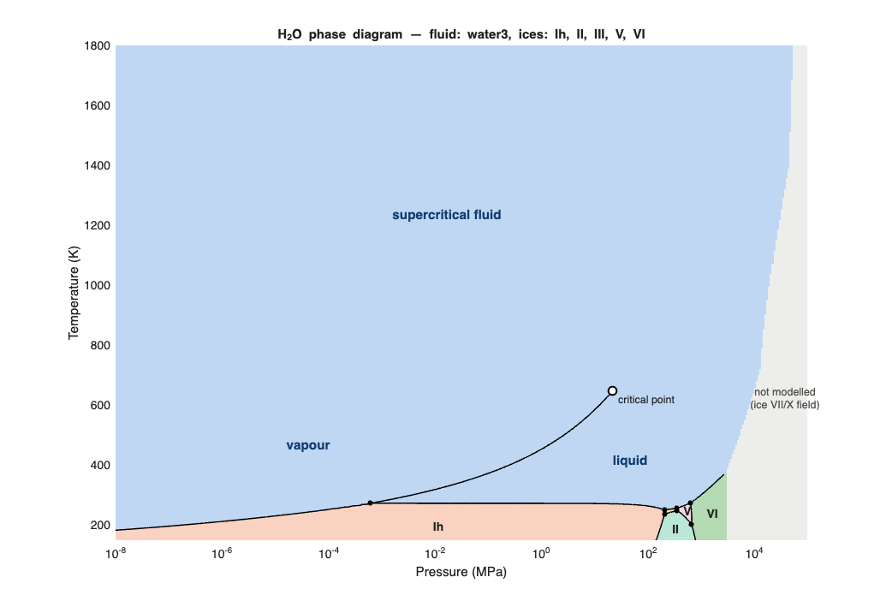
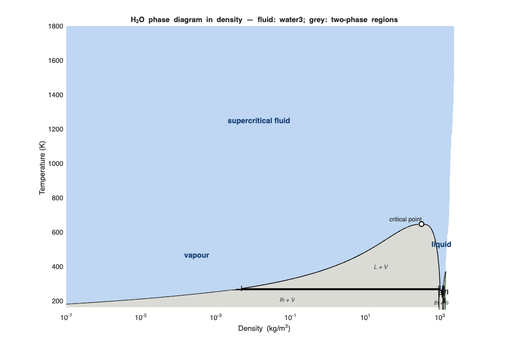
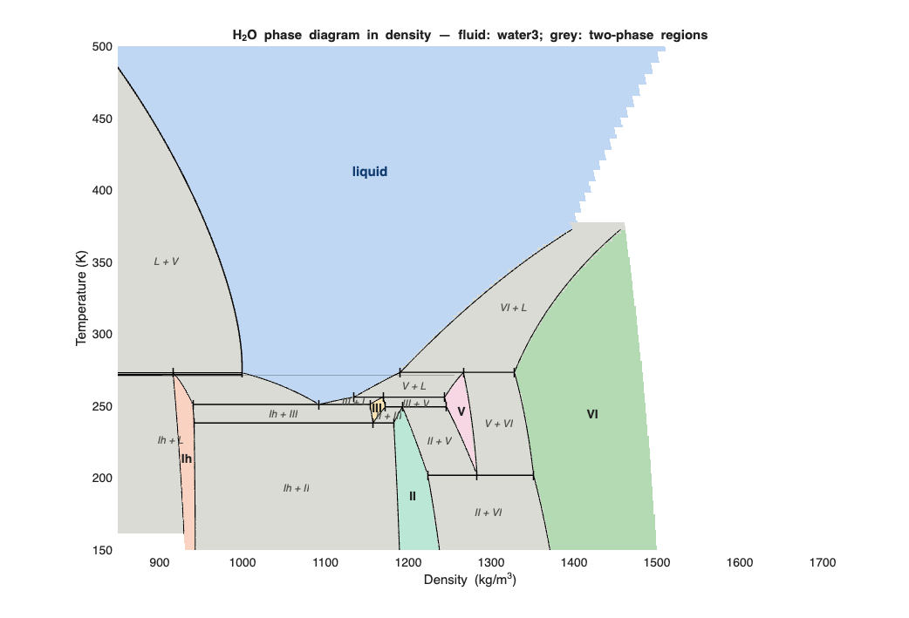
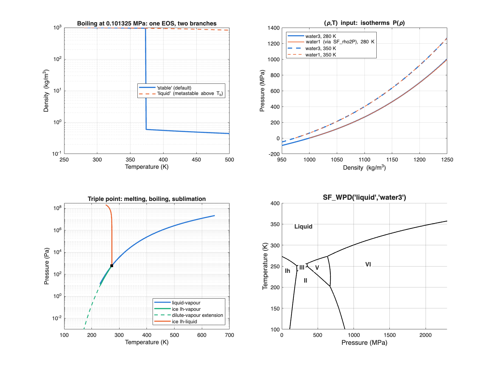
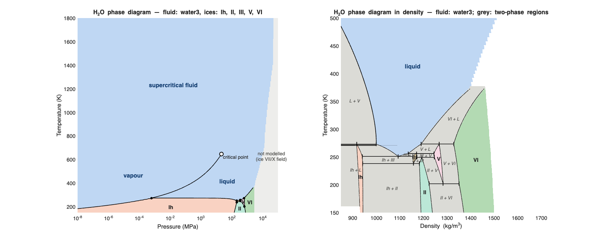

# SeaFreeze

V1.2 beta (Matlab version, `1.2.0-beta`)

The SeaFreeze package computes thermodynamic and elastic properties of water, ice polymorphs (Ih, II, III, V, VI, VII and X) and aqueous NaCl solutions in the 0-100 GPa and 220-10000 K range, with the study of icy worlds and their oceans in mind. It is based on Gibbs Local Basis Function (LBF) parametrizations (https://github.com/jmichaelb/LocalBasisFunction) for each phase. The formalism is described in Brown (2018), Journaux et al. (2020), and in the liquid water Gibbs parametrization by Bollengier, Brown, and Shaw (2019). Since 1.2 it also includes `water_Brown2026`, fluid water from a Helmholtz energy surface covering vapour, liquid and supercritical states (230 K – 150 000 K, dilute vapour to 16 000 kg/m³), with liquid–vapour and ice–vapour equilibria and full phase diagrams in (P,T) and (ρ,T).

## What's new in 1.2 beta
- **Clearer material names** — `water1`, `water2`, `water3` are now `water_Bollengier2019`, `water_Brown2018`, `water_Brown2026`; `NaClaq_LP`, `NaClaq_HP`, `NaClaq_5GPa_2024` are now `NaClaq_Brown2026_LP`, `NaClaq_Brown2026_HP`, `NaClaq_Brown2024` (`NaClaq` stays a shortcut for `NaClaq_Brown2026`); the old names still work through 1.x with a once-per-session warning (see *Renamed materials*).
- **`water_Brown2026`** — Helmholtz-energy fluid water (vapour, liquid, supercritical) from the psi-spline surface *stage5_23c*; stable / liquid / vapour branch selection at (P,T). See [`water_Brown2026`](#water_brown2026-helmholtz-energy-fluid-water-new-in-12-beta).
- **Density input for every material** — `SF_getprop(rhoT, material, props, 'input', 'rhoT')`: (ρ,T) or (ρ,T,m) points; Gibbs splines are inverted with `SF_rho2P`.
- **Vapour equilibria** — `SF_coexistence('saturation', T)` and `SF_coexistence('sublimation', T)`, with a dilute-vapour extension below 230 K (on by default, warns once per session).
- **Full phase diagrams** — `SF_WPD_PT`, `SF_WPD_rhoT` (+ `sf_phase_map`, `sf_triple_points`, `sf_melt_T_dq2026`): vapour, liquid, supercritical fluid, critical point and ices, with two-phase regions and triple-point tie lines in (ρ,T).
- **`water_Brown2026` in the phase-boundary tools** — `SF_WhichPhase(PT, 'liquid', 'water_Brown2026')`, `SF_PhaseLines(ice, 'water_Brown2026')`, `SF_WPD('liquid', 'water_Brown2026')`.
- **GNU Octave** — the same sources run under MATLAB and Octave (see [Running under Octave](#running-under-octave)).
- Faster Helmholtz evaluation (gridded root bracketing, Hermite starts) and an in-memory spline cache.

## What's new in 1.1.3
- **`SF_rho2P`** — New utility function that inverts the EOS to find pressure (MPa) from a target density (kg/m³) and temperature (K), for any supported material. Uses Newton-Raphson iteration with the isothermal bulk modulus `Kt` and a bisection fallback for robustness. Fixed a low-P convergence issue that caused NaN results for all ice phases (Ih, II, III, V, VI) near the 0.1 MPa lower domain boundary.

## What's new in 1.1.0
- **Aqueous NaCl solutions** (`NaClaq_Brown2026`) via the same 3D (P,T,m) spline used by the Python version, including a corrected scatter-input mixing-quantities path that uses a per-row baseline at `m = cutoff` (previously broken with a runtime warning).
- **New outputs**: `Js` (Joule-Thomson coefficient) and `gamma_Gruneisen` (Grüneisen parameter) for every phase; `m`, `xs`, `xw`, `f`, `mus`, `muw`,`Vm`, `Vw`, `Cpm`, `Va`, `Cpa`, `Vex`, `phi`, `aw` for `NaClaq_Brown2026` mixing (see table below)
- **Selective property computation**: ask for only the properties you need (e.g. just `rho` or `{'G','Cp'}`) to save time.
- **No Curve Fitting Toolbox required** — the entire package (`SF_getprop`, `SF_PhaseLines`, `SF_WhichPhase`) is toolbox-free. A single in-tree de Boor evaluator (`sp_val`) handles every phase and all derivative orders.
- **Optional `sp.Tc`** (dimensionless temperature, `tau = log(T/Tc)`) and **`sp.mask`** (validity-domain interpolation) supported by `fnGval` for new spline parametrizations.
- **Cross-validation test suite** comparing the MATLAB output against the Python reference implementation: 14 cases including grid + scatter + edge molalities for NaCl, with per-case relative-tolerance overrides for known ice-V drifts and freshness/manifest checks on the reference `.mat`.

## Getting started

### Prerequisites
Tested on MATLAB R2018a and newer. **No toolboxes required.** The entire package uses an in-tree de Boor evaluator (`sp_val.m`) for every phase and derivative order, plus base-MATLAB `contourc` for the phase-line solver.

**GNU Octave** is also supported — see [Running under Octave](#running-under-octave) below.

### Installing
Use `addpath` with `genpath` so that MATLAB also picks up the `internal/` helpers and the per-phase spline files inside `splines/`:

```matlab
addpath(genpath('/path/to/SeaFreeze/Matlab'))
```

All spline data files ship inside `Matlab/splines/` — no extra downloads required. You can verify the install with:

```matlab
SeaFreeze_version   % should print '1.2.0-beta'
```

### Running under Octave

The same sources run unmodified under GNU Octave; install them the same way, with
`addpath(genpath('/path/to/SeaFreeze/Matlab'))`. The public API — `SF_getprop`,
`SF_WhichPhase`, `SF_PhaseLines`, `SF_WPD`, `SF_rho2P`, `SF_phase_range` — behaves identically.

One thing differs behind the scenes. Ten of the spline files in `splines/` are saved in MATLAB
v7.3 format, which is HDF5 underneath; in that format `sp.knots` is a cell array stored behind
HDF5 object references that Octave's `load` cannot follow. Those ten files are therefore mirrored
in `splines_octave/` in MAT v7 format, and `sf_load_spline` reads from there when it detects
Octave, falling back to `splines/` for the five NaCl files that are already v7. Nothing about this
is visible to callers.

If the splines in `splines/` are ever regenerated, refresh the mirror with:

```bash
python3 tools/convert_splines_for_octave.py           # rewrite splines_octave/
python3 tools/convert_splines_for_octave.py --check   # validate without writing
```

To check an Octave install against MATLAB-generated reference values:

```bash
octave --no-gui --eval "addpath(genpath('Matlab')); sf_verify_octave"
```

`sf_verify_octave` compares `SF_getprop` against all nine cases in
`test/reference_getProp.mat` and `SF_PhaseLines` against the eighteen curves in
`test/reference_phaselines.mat` — both generated by MATLAB — and then smoke-tests the rest of the
API. It is a portability check, not a replacement for the MATLAB test suite in `test/`, which uses
`matlab.unittest` and does not run under Octave.

Numerically the two interpreters agree to round-off: all nine property cases match to better than
1e-15 relative, and all eighteen phase-line curves come back with identical point counts and agree
to ~1e-11 in (P, T). The remaining differences are cosmetic, and confined to figures:

- **Colour map.** Octave has no `parula`, so `SF_WPD`'s NaCl overlay uses `viridis` there
  (`internal/compat/sf_parula.m`). Same ordering and perceptual ramp, different exact colours.
- **Legend placement.** `'Location','best'` is unimplemented in Octave; it falls back to
  `'northeast'` and prints a warning.
- **Option names must be exact.** `PartialMatching` is now switched off on every `inputParser` in
  the package. Octave's partial matching resolved the ambiguous abbreviation `'m'` — a prefix of
  `'meta'` — to the wrong parameter and silently validated it against another option's rule.
  Abbreviated option names were never documented, so only exact names such as `'solute'` and
  `'meta'` are accepted, now identically on both interpreters.

## Running SeaFreeze

```matlab
out = SF_getprop(PT, material)           % all supported properties (default)
out = SF_getprop(PT, material, props)    % only the requested properties
```

> **Deprecation note (1.1.0):** the legacy entry point `SeaFreeze(PT, material, ...)` still works and is kept as a thin alias for `SF_getprop`. It emits a one-time warning per MATLAB session. Suppress it with `warning('off','SeaFreeze:deprecated')`. Migrate calls to `SF_getprop` at your convenience; the alias will be removed in a future release.

### Inputs

**`PT`** — pressure–temperature (–molality) coordinates.
- Pure phases: cell `{P,T}` (gridded output) or N×2 array `[P T]` (scatter output).
- `NaClaq_Brown2026`: cell `{P,T,m}` (gridded) or N×3 array `[P T m]` (scatter).
- Units: P in MPa, T in K, m in mol/kg. Points outside the parametrization return `NaN`.

**`material`**
| Name | Description |
|------|-------------|
| `Ih` | Ice Ih (Feistel and Wagner, 2006) |
| `II`, `III`, `V`, `VI` | Ices II–VI (Journaux et al. 2020) |
| `VII_X_French` | Ice VII / ice X (French and Redmer 2015) |
| `water_Bollengier2019` | Liquid water — Bollengier et al. 2019 (≤500 K, ≤2300 MPa) |
| `water_Brown2018` | Liquid water — Brown 2018 (up to 100 GPa) |
| `water_IAPWS95` | IAPWS95 water (Wagner and Pruss, 2002) |
| `water_Brown2026` | Fluid water (vapour, liquid, supercritical) from a Helmholtz energy surface F(ρ,T), 230 K – 150 000 K — **new in 1.2**, see [`water_Brown2026`](#water_brown2026-helmholtz-energy-fluid-water-new-in-12-beta) |
| `NaClaq_Brown2026` | Aqueous NaCl — stitched LP+HP 2026, recommended (0–10000 MPa, 229–2001 K, 0–7 mol/kg); shortcut `NaClaq` |
| `NaClaq_Brown2026_LP` | NaCl(aq) low-P only (0–1000 MPa, 230–501 K) |
| `NaClaq_Brown2026_HP` | NaCl(aq) high-P only (500–10000 MPa, 229–2001 K) |
| `NaClaq_Brown2024` | NaCl(aq) Brown 2024 legacy (0–5000 MPa, 229–501 K) |

**Renamed materials (1.2).** The numbered water names and the NaCl(aq) names are replaced by author–year names. The old names keep working throughout SeaFreeze 1.x: they are mapped to the new name with a `SeaFreeze:deprecatedMaterial` warning, shown once per session for each old name, and give identical results. They will be removed in SeaFreeze 2.0. Functions that return material names (e.g. `phasenum2phase`, phase-diagram labels) return the new names. Silence the warning with `warning('off','SeaFreeze:deprecatedMaterial')`.

| Old name | New name | Equation of state |
|---|---|---|
| `water1` | `water_Bollengier2019` | liquid water, Bollengier et al. 2019 (≤ 500 K, ≤ 2300 MPa) |
| `water2` | `water_Brown2018` | liquid water, Brown 2018 (to 100 GPa) |
| `water3` | `water_Brown2026` | fluid water (vapour, liquid, supercritical), Helmholtz surface, Brown & Journaux 2026 |
| `water_IAPWS95` | `water_IAPWS95` (unchanged) | IAPWS-95, Wagner & Pruss 2002 |
| `NaClaq_LP` | `NaClaq_Brown2026_LP` | NaCl(aq) low-P spline, Brown 2026 |
| `NaClaq_HP` | `NaClaq_Brown2026_HP` | NaCl(aq) high-P spline, Brown 2026 |
| `NaClaq_5GPa_2024` | `NaClaq_Brown2024` | NaCl(aq) to 5 GPa, Brown 2024 (legacy) |
| `NaClaq_HP_v1` … `_v3` | `NaClaq_Brown2026_HP_v1` … `_v3` | alternative high-P fits (Matlab only) |
| `NaClaq` | `NaClaq_Brown2026` | stitched LP+HP NaCl(aq), Brown 2026 — **`NaClaq` stays a permanent shortcut** (no warning) for the recommended NaCl(aq) model |

**`props`** *(optional)* — a string or cell array of property names. Omit or pass `[]` to compute all supported properties.

**Name-value options** *(new in 1.2)*
- `'input', 'rhoT'` — the first coordinate is density (kg/m³) instead of pressure; P (MPa) is returned. Works for every material (Gibbs splines are inverted with `SF_rho2P`).
- `'branch', 'stable' | 'liquid' | 'vapor'` — Helmholtz materials (`water_Brown2026`) only: which fluid root to return at (P,T).

### Outputs
`out` is a struct with the requested fields (SI units).

Common to all materials:

| Quantity | Field | Unit |
|----------|:-----:|:----:|
| Gibbs energy | `G` | J/kg |
| Entropy | `S` | J/K/kg |
| Internal energy | `U` | J/kg |
| Enthalpy | `H` | J/kg |
| Helmholtz free energy | `A` | J/kg |
| Density | `rho` | kg/m³ |
| Isobaric heat capacity | `Cp` | J/kg/K |
| Isochoric heat capacity | `Cv` | J/kg/K |
| Isothermal bulk modulus | `Kt` | MPa |
| Pressure derivative of `Kt` | `Kp` | – |
| Isentropic bulk modulus | `Ks` | MPa |
| Thermal expansivity | `alpha` | 1/K |
| Bulk sound speed | `vel` | m/s |
| Joule-Thomson coefficient | `Js` | K/MPa |
| Grüneisen parameter | `gamma_Gruneisen` | – |
| Pressure echo | `P` | MPa |
| Temperature echo | `T` | K |

`P` and `T` echo back the input coordinate arrays. They are present when all properties are requested (no `props` argument) and can also be requested explicitly, e.g. `SF_getprop(PT, 'VI', {'rho','P','T'})`.

Solid phases additionally provide:

| Quantity | Field | Unit |
|----------|:-----:|:----:|
| Shear modulus | `shear` | MPa |
| P-wave velocity | `Vp` | m/s |
| S-wave velocity | `Vs` | m/s |

`NaClaq_Brown2026` additionally provides mixing properties:

| Quantity | Field | Unit |
|----------|:-----:|:----:|
| Molality echo | `m` | mol/kg |
| Solute mole fraction | `xs` | – |
| Solvent mole fraction | `xw` | – |
| kg-of-solution per kg-of-water factor | `f` | – |
| Solute chemical potential | `mus` | J/mol |
| Solvent chemical potential | `muw` | J/mol |
| Partial molar volume of solute | `Vm` | cm³/mol |
| Partial molar volume of solvent | `Vw` | cm³/mol |
| Partial molar heat capacity of solute | `Cpm` | J/mol/K |
| Apparent molar volume | `Va` | cm³/mol |
| Apparent molar heat capacity | `Cpa` | J/mol/K |
| Excess volume | `Vex` | cm³/mol |
| Osmotic coefficient | `phi` | – |
| Water activity | `aw` | – |

## Examples

### Single point (all properties)
```matlab
PT = [900 255];
out = SF_getprop(PT, 'VI');
```

### Grid input
Ice V every 2 MPa from 400 to 500 MPa and every 0.5 K from 240 to 250 K:
```matlab
PT = {400:2:500, 240:0.5:250};
out = SF_getprop(PT, 'V');
```

### Scatter input
Three points for liquid water:
```matlab
PT = [200 300; 223 300; 225 300];
out = SF_getprop(PT, 'water_Bollengier2019');
```

### Selective properties (new in 1.1.0)
Only density for an ice VI grid:
```matlab
out = SF_getprop({400:10:900, 240:5:270}, 'VI', 'rho');
```
G, ρ and Cp only:
```matlab
out = SF_getprop([900 255], 'VI', {'G','rho','Cp'});
```
Requesting shear/Vp/Vs pulls in the minimum dependencies automatically:
```matlab
out = SF_getprop([900 255], 'VI', 'Vp');   % returns only Vp
```

### Aqueous NaCl (new in 1.1.0)
For `NaClaq_Brown2026`, `PT` is extended to `(P, T, m)` with molality `m` in mol/kg.

Single point — osmotic coefficient, water activity and apparent properties at 200 MPa, 280 K, 0.5 mol/kg NaCl:
```matlab
PTm = [200 280 0.5];
out = SF_getprop(PTm, 'NaClaq_Brown2026', {'phi','aw','Vex','Va','Cpa'});
% out.phi   ≈ 0.9042   (osmotic coefficient)
% out.aw    ≈ 0.9838   (water activity)
% out.Vex   ≈ 0.444    (apparent excess volume, cm^3/mol)
% out.Va    ≈ 23.12    (apparent molar volume, cm^3/mol)
% out.Cpa   ≈ 15.37    (apparent molar heat capacity, J/mol/K)
```

Scatter list — three arbitrary (P,T,m) conditions:
```matlab
PTm = [100 298 0.5; 200 323 1.0; 500 373 3.0];
out = SF_getprop(PTm, 'NaClaq_Brown2026', {'rho','Cp','mus','muw','aw'});
% out.rho, out.Cp, out.aw, ...   each [3x1]
```

Grid input — sweep pressure 0.1–500 MPa, temperature 273–400 K, molality 0.1–3 mol/kg, all properties:
```matlab
P = 0.1:100:500;        % MPa
T = 273:25:400;         % K
m = [0.1 0.5 1.0 3.0];  % mol/kg
out = SF_getprop({P,T,m}, 'NaClaq_Brown2026');
% rows -> P, columns -> T, third dim -> m
% e.g. out.rho is size [length(P) length(T) length(m)]
```

Subset for speed (e.g. only density and water activity on the same grid):
```matlab
out = SF_getprop({P,T,m}, 'NaClaq_Brown2026', {'rho','aw'});
```

`NaN` is returned outside the parametrization bounds (≤5000 MPa, 229–501 K, up to ~7 mol/kg).

## Utility functions

### `SeaFreeze_version`
Return the current version string:
```matlab
SeaFreeze_version
% '1.2.0-beta'
```

### `SF_WhichPhase`
Determine which supported phase is stable at a given (P,T). `PT` has the same format as `SeaFreeze`. Output integers: 0 = liquid, 1 = ice Ih, 2 = II, 3 = III, 5 = V, 6 = VI; `NaN` outside all parametrizations.
```matlab
SF_WhichPhase({300,300})   % -> 0 (liquid water)
```

By default the liquid is pure water (`water_Bollengier2019`). Pass `'solute','NaCl'` to use aqueous NaCl as the liquid; `PT` then needs the molality axis as `{P,T,m}` or `[P T m]`. The comparison is made on the chemical potential of water (μw_solution vs `G_ice·M_H2O`), so it captures freezing-point depression by salt:
```matlab
% Stability map for a 2 mol/kg NaCl solution from 0-1000 MPa, 240-300 K
out = SF_WhichPhase({0:10:1000, 240:1:300, 2}, 'solute','NaCl');
```

### `SF_PhaseLines`
Compute the equilibrium curve between two phases by zero-contouring the Gibbs-energy difference (or, for ice ↔ NaClaq, the chemical-potential difference for water). Returns a struct with `(P, T)` along the curve, a stable-vs-metastable mask based on per-pair triple points, and the relevant triple-point coordinates. Optional rendering plots stable as solid red and metastable extensions as dotted red, with triple points marked.

The default sampling grid is the **intersection** of both phases' spline knot domains (auto-derived via `SF_phase_range`); pass `'P'` and/or `'T'` to override.

**Supported pairs (28):** the 11 pure-phase pairs of the original water phase diagram, 5 ice ↔ NaClaq melting pairs, **II ↔ water_Bollengier2019** (entirely metastable), **VII_X_French ↔ water_Bollengier2019 / water_Brown2018 / water_IAPWS95** (high-pressure melting curve, stable above the VI–VII–water triple point at ~2216 MPa, 354 K), and the four low-P ice phases (Ih/III/V/VI) paired with **water_Brown2018** and **water_IAPWS95** for cross-EOS comparison. Note: ice melt curves drift from the canonical water_Bollengier2019-based ones at low P when paired with water_Brown2018 or water_IAPWS95, since water_Bollengier2019 is the SeaFreeze liquid optimised for that range.

```matlab
% Pure-water Ih melting curve, full curve including metastable extensions
out = SF_PhaseLines('Ih', 'water_Bollengier2019');
%   out.P, out.T : (Nx1) curve coordinates
%   out.stable   : (Nx1) logical, true on the thermodynamically stable portion
%   out.triple_points : (Mx2) [T_K, P_MPa]

% Stable portion only (no metastable extensions)
out = SF_PhaseLines('Ih', 'water_Bollengier2019', 'segment', 'stable');

% Render the curve and triple points
out = SF_PhaseLines('VI', 'water_Bollengier2019', 'plot', true);

% NaClaq melting curve at fixed molality (mol/kg)
out = SF_PhaseLines('Ih', 'NaClaq_Brown2026', 'm', 1.0);
% At P=0, m=1, T ≈ 269.8 K (FPD ≈ 3.3 K including the van't Hoff factor)

% Multiple molalities at once — returns a struct array, plots all curves
% in distinct colours with a legend
out = SF_PhaseLines('Ih', 'NaClaq_Brown2026', 'm', [1.0, 2, 4, 5], 'plot', true);
%   numel(out)  == 4
%   out(k).m    == [1, 2, 4, 5](k)
%   out(k).fig  : shared figure handle on every entry
```



```matlab
% Override the default sampling grid
out = SF_PhaseLines('III', 'water_Bollengier2019', 'P', 200:0.5:350, 'T', 240:0.1:260);

% Compose multiple curves on the same figure: pass the figure handle
% returned by a previous call as the 'plot' argument. Subsequent calls
% overlay new curves without resetting axis labels, title or grid.
o1 = SF_PhaseLines('Ih','water_Bollengier2019','plot',true);                  % new figure
SF_PhaseLines('III','water_Bollengier2019','plot',o1.fig);                    % overlay
SF_PhaseLines('VI','water_Bollengier2019','plot',o1.fig);                     % overlay
SF_PhaseLines('Ih','NaClaq_Brown2026','m',[1 2 3],'plot',o1.fig);         % overlay multi-m
legend(gca(o1.fig), 'show', 'Location','best');                 % show legend
```

For `NaClaq_Brown2026` pairs, the entire curve is returned as `stable`; distinguishing stable from metastable for ice ↔ NaClaq requires triple points whose locations depend on molality (not currently supported).

A frozen copy of the v1 (Clinton & Journaux 2020) implementation lives in `SF_PhaseLines_v1.m` for regression-comparison and is exercised by `test/test_SF_PhaseLines.m`. To produce side-by-side comparison figures, run `test/compare_SF_PhaseLines`.

### `SF_WPD`
Plot the full H₂O water phase diagram, computed dynamically from Gibbs energy splines via `SF_PhaseLines`. Supports NaCl(aq) melting-curve overlays, metastable extensions, and phase-field labels.

```matlab
SF_WPD()                                        % pure water, new figure
SF_WPD('solute','NaCl', 'm', [0.5 1 2 4])      % NaClaq melting-curve overlay
SF_WPD('meta', false)                           % hide metastable extensions
SF_WPD('labels', false)                         % hide phase-field labels
SF_WPD('ax', gca)                               % overlay on existing axes
fig = SF_WPD(...)                               % return figure handle
```

| Parameter | Default | Description |
|-----------|---------|-------------|
| `'ax'` | `[]` (new figure) | Axes handle to plot onto |
| `'solute'` | `'none'` | `'none'` or `'NaCl'` to overlay NaClaq melting curves |
| `'m'` | `[]` | Scalar or vector of molality values (mol/kg) for NaClaq |
| `'meta'` | `'default'` | `'default'` — only Ih–II and II–VI metastable extensions (matching v1); `true` / `'all'` — all pairs; `false` / `'none'` — none |
| `'labels'` | `true` | Annotate stability fields with phase names |

### `SF_phase_range`
Return the knot-domain bounds (P, T, and optionally m) for any supported material. Used internally by `SF_PhaseLines` to auto-build the sampling grid, but also useful for checking validity ranges.

```matlab
rng = SF_phase_range('Ih');
% rng.P  = [0.1, 2500]   (MPa)
% rng.T  = [1, 400]      (K)

rng = SF_phase_range('NaClaq_Brown2026');
% rng.P, rng.T, rng.m    (m in mol/kg)
```

### `SF_rho2P`
Invert the SeaFreeze EOS: find P (MPa) such that `rho(P,T) == rho_target` for any supported material. Uses Newton-Raphson with the isothermal bulk modulus `Kt` and a bisection fallback; returns `NaN` where no solution exists within the spline domain.

```matlab
P = SF_rho2P(rho_target, T, material)
P = SF_rho2P(rho_target, T, material, m)              % NaClaq: molality (mol/kg)
P = SF_rho2P(rho_target, T, material, 'P0', Pguess)   % initial guess (MPa)
P = SF_rho2P(rho_target, T, material, 'tol', 0.001)   % convergence tol (default 0.01 MPa)
```

`rho_target` and `T` may be scalar or arrays; scalar `T` broadcasts against `rho_target`. Output is the same shape as `rho_target`.

```matlab
% Compressed liquid water (≈ 300 MPa)
P = SF_rho2P(1100, 300, 'water_Bollengier2019')

% Ice Ih (≈ 104 MPa)
P = SF_rho2P(930, 255, 'Ih')

% Ice VI scatter
P = SF_rho2P([1310 1350 1390], [255 260 265], 'VI')

% NaClaq at 1 mol/kg, with tight tolerance
P = SF_rho2P(1050, 300, 'NaClaq_Brown2026', 1.0, 'tol', 1e-4)
```

## `water_Brown2026`: Helmholtz-energy fluid water (new in 1.2 beta)

`water_Brown2026` is fluid water — vapour, liquid and supercritical fluid — from a Helmholtz energy surface F(ρ,T): the
psi-spline surface *stage5_23c* (J. M. Brown & B. Journaux, lbf-thermo 2026; the Hugoniot-favoured variant of the stage 23 release). Unlike the other SeaFreeze phases it is
not a Gibbs spline G(P,T): the residual Helmholtz energy is a tensor B-spline in (ln ρ, ln T) plus analytic ideal-gas,
reacting-mixture, critical (KW2000) and low-temperature two-structure terms, evaluated by `internal/fnFval.m` and
`internal/psi_val.m` (a toolbox-free port of lbf-thermo's `psiH2O_val`). It shares the IAPWS-95 reference state with
the ice splines, so it can be used with them for phase equilibria.

At (P,T) SeaFreeze solves P = ρ²∂F/∂ρ for the density and returns the **stable** branch (lower Gibbs energy: vapour
below the saturation pressure, liquid above); `'branch','liquid'` or `'branch','vapor'` returns the metastable branch.

### Range of validity

| | water_Brown2026 range |
|---|---|
| Temperature | 230 K – 150 000 K (surface knots). Below 230 K only the dilute vapour is available, through the ideal-gas extension used by the sublimation curve and the phase diagrams |
| Density | up to 16 000 kg/m³; below 10⁻⁴ kg/m³ the surface is continued by a virial form and a low-density chemistry table |
| Pressure | from the dilute vapour to ~10 TPa (P = ρ²∂F/∂ρ over the box) |
| Phases | vapour, liquid, supercritical fluid; at (P,T) the stable branch (lower Gibbs energy; as a safeguard, roots with C_v ≤ 0 or (∂P/∂ρ)_T ≤ 0 are never returned) is returned unless `branch` = `'liquid'` / `'vapor'` |
| Not water | more than 40 K below the melting curve of the stable solid (the surface's own validity mask, psiEOS `dq2026` model); the phase diagrams apply this mask |
| Use with care | cold ultra-dense corner (ρ > 4000 kg/m³, T < 1000 K: not constrained by data); interior of the two-phase dome (spinodals are data-free; a few small (∂P/∂ρ)_T sign changes remain at 600–620 K, and a thin unstable sliver on the critical isochore up to 647.2 K); near T_c, c_v and c_p carry ≤ 0.2–0.5 % structure at 705–753 K / 470–535 kg/m³ and next to the saturated liquid at 19–21 MPa, 630–640 K; dense fluid: K_T follows the Walsh & Rice / Mitchell & Nellis principal Hugoniot, ~10 % above the PBE DFT sets at 2.2–2.5 g/cm³ (40–60 GPa); supercooled liquid below 230 K and stretched liquid below −140 MPa are extrapolations |

### Accuracy

| Check | Result |
|---|---|
| Ambient liquid (0.101325 MPa, 298.15 K) | ρ = 997.048 kg/m³, Cp = 4181.4 J/kg/K, sound speed 1496.7 m/s |
| Evaluator vs the reference implementation (psiH2O_val, lbf-thermo) | 2e-13 (Matlab), 2e-10 (Python) relative |
| Vapour pressure vs IAPWS-95 (273.16–646.5 K) | within 0.02 % (0.01 % below 620 K); p_σ(373.124 K) = 0.101323 MPa |
| Saturated-vapour density vs NIST WebBook | within ~0.1 % to 620 K |
| Vapour / supercritical isotherms 300–1000 K vs NIST WebBook | within 0.1 % |
| Ice Ih sublimation (water_Brown2026 vapour + ice Ih) vs IAPWS R14-08 | within ±0.008 % over 230–273.16 K |
| Ice Ih sublimation vs NIST measurements (Bielska et al. 2013, 175–253 K) | every point within 3σ (dilute-vapour extension below 230 K) |
| Ice–liquid curves vs `water_Bollengier2019` | within 0.015 K (Ih, III) and 0.06 K (V) up to 632 MPa; 0.35 K along ice VI to 2.3 GPa; Ih melting at 0.101325 MPa = 273.159 K |
| Triple points | within 0.06 K of the literature values; Ih–liquid–vapour at 273.1664 K, 611.9 Pa |
| Stable liquid vs `water_Bollengier2019` (240–500 K, ≤ 2.3 GPa) | ρ rms 0.05 % (max 0.13 %), Cp rms 0.8 % |




### Evaluating `water_Brown2026`

```matlab
% (P,T) scatter: stable branch — liquid at ambient, vapour at 1 kPa / 300 K
out = SF_getprop([0.101325 298.15; 1e-3 300], 'water_Brown2026');
out.rho                                   % [997.048; 0.00722]

% grid input, as for every other phase (rows: P, columns: T)
out = SF_getprop({[0.1 50 500], [280 300 320]}, 'water_Brown2026', {'rho','alpha'});

% the metastable branch: superheated liquid at 1 kPa / 300 K
out = SF_getprop([1e-3 300], 'water_Brown2026', {'rho','G'}, 'branch', 'liquid');
```

### Density–temperature input (all materials)

`'input','rhoT'` makes the first coordinate density (kg/m³) instead of pressure; P (MPa) is returned. `water_Brown2026` is
evaluated directly; the Gibbs splines (water_Bollengier2019/2, IAPWS95, ices, NaClaq with molality) first solve P(ρ,T) with
`SF_rho2P` (1e-6 MPa) and then evaluate at (P,T). `rho` and `T` echo the input; NaN where no pressure in the spline
range gives the requested density.

```matlab
out = SF_getprop([1000 300; 1100 300], 'water_Brown2026', {'P','Cp'}, 'input', 'rhoT');
out.P                                     % [7.833; 299.53] MPa
out = SF_getprop([1000 300; 1100 300], 'water_Bollengier2019', {'P','Cp'}, 'input', 'rhoT');
out = SF_getprop([1330 260], 'VI', {'P','Vp','Vs'}, 'input', 'rhoT');
out = SF_getprop([1050 300 1.0], 'NaClaq_Brown2026', {'P','muw'}, 'input', 'rhoT');

% isochores on a grid: rows are densities, columns temperatures
out = SF_getprop({linspace(950, 1250, 7), [280 350]}, 'water_Bollengier2019', 'P', 'input', 'rhoT');
```

### Vapour equilibria: saturation and sublimation — `SF_coexistence`

`SF_coexistence` solves G_A = G_B by Newton iteration in ln P and returns a struct with `T`, `P` (MPa), `rho_A`
(liquid or ice) and `rho_B` (vapour).

```matlab
sat = SF_coexistence('saturation', linspace(273.16, 646.5, 200));   % liquid-vapour, to the critical point
sat.P, sat.rho_A, sat.rho_B
s = SF_coexistence('saturation', 373.124);   s.P          % 0.101323 MPa

sub = SF_coexistence('sublimation', linspace(170, 273.16, 150));    % ice Ih - vapour
s = SF_coexistence('sublimation', 250);      s.P * 1e6    % 76.015 Pa  (IAPWS R14-08: 76.013 Pa)
s = SF_coexistence('sublimation', 200, 'dilute_extension', false);  % NaN below 230 K without the extension
```

Below 230 K (the lowest temperature of water_Brown2026) the vapour is the surface's ideal-gas part alone (Z = 1): at those
sublimation pressures (< 10 Pa) the neglected virial terms change p_sub by ~1e-5 relative. This **dilute-vapour
extension is on by default**; a `SeaFreeze:diluteExtension` warning is issued the first time it is used in a session,
and `'dilute_extension', false` returns NaN below 230 K instead.




### Full phase diagrams in (P,T) and (ρ,T) — `SF_WPD_PT`, `SF_WPD_rhoT`

`SF_WPD_PT` and `SF_WPD_rhoT` draw the whole H₂O phase diagram — vapour, liquid, supercritical fluid, the critical
point and the ices — by Gibbs-energy minimisation over `water_Brown2026` and the ices (default Ih, II, III, V, VI; ice VII/X is
left out until an updated model is available, pass `'ices', ...` to change). Boundaries are the G_i = G_j contours
between neighbouring stable phases; triple points are refined by Newton on G_a = G_b = G_c. In (ρ,T) the density gaps
between coexisting phases are the two-phase regions (grey), separated by the three-phase tie lines through the triple
points.

```matlab
SF_WPD_PT()                                          % 1e-8 - 1e5 MPa (log), 150 - 1800 K
SF_WPD_PT('P', [1e-6 1e4], 'T', [200 800], 'nP', 300, 'nT', 250)
SF_WPD_rhoT()                                        % log density: vapour, L+V dome, liquid, ices
SF_WPD_rhoT('rho', [850 1700], 'T', [150 500], 'P', [1e-10 1e4], 'xscale', 'linear')   % dense zoom

% the underlying data
[fig, pm] = SF_WPD_PT();                             % pm = sf_phase_map(...): names, stable, rho_stable
tp = sf_triple_points(pm, 'water_Brown2026');                 % struct array: labels, P, T, rho
```

Validity masks (on by default, see `internal/sf_phase_map.m`): an ice competes only where its spline is physical
(ρ > 0, K_T > 0, 0 < Cp < 2 × 9R/M), and the fluid is not used more than 40 K below the stable-solid melting curve
(`sf_melt_T_dq2026`) above the triple-point pressure. Cells where no phase is available (the ice VII/X field) are grey
and marked *not modelled*.





These functions evaluate `water_Brown2026` at 10⁵–10⁶ states and warn at start (`SeaFreeze:longRuntime`; silence with
`warning('off','SeaFreeze:longRuntime')`). Typical run times:

| Default call | Python | Matlab |
|---|---|---|
| (P,T) diagram (`wpd_PT` / `SF_WPD_PT`) | ~10 s | ~35 s |
| (ρ,T) diagram, log density (`wpd_rhoT` / `SF_WPD_rhoT`) | ~16 s | ~55 s |
| (ρ,T) dense zoom (850–1700 kg/m³, 150–500 K) | ~19 s | ~75 s |

Measured on an Apple-silicon Mac (Matlab R2025b Intel build under Rosetta); times scale with the grid size (`nP`, `nT`) and depend on the machine. The Matlab functions issue a `SeaFreeze:longRuntime` warning at start.

### `water_Brown2026` as the liquid in the phase-boundary tools

```matlab
SF_WhichPhase({[0.1 300 800], [260 270 276 300]}, 'liquid', 'water_Brown2026')   % 0 = liquid, 1 = Ih, ...
r = SF_PhaseLines('Ih', 'water_Brown2026');                                       % Ih, II, III, V, VI pairs with water_Brown2026
SF_WPD('liquid', 'water_Brown2026')                                               % melting curves from water_Brown2026
```

### Tutorial

[`examples/water_Brown2026_tutorial.m`](examples/water_Brown2026_tutorial.m) runs every example above (MATLAB or Octave) and saves the
two figures below (set `outdir` before running to choose where).




## Tests

The MATLAB package ships with a function-style and classdef-style test suite plus a Python cross-validation harness. See [`test/README.md`](test/README.md) for how to run them, what each suite covers, and the documented tolerances / known differences.

## Important remarks

### Water representation
Ice Gibbs parametrizations are optimized for use with `water_Bollengier2019` (Bollengier et al. 2019), particularly for phase-equilibrium calculations. Using other water parametrizations will yield incorrect melting curves. `water_Brown2018` and `water_IAPWS95` are provided for high-pressure extension and comparison only. Use `water_Bollengier2019` for the 200–355 K, ≤2300 MPa range. `water_Brown2026` (Helmholtz surface, 1.2 beta) shares the same reference state and reproduces the `water_Bollengier2019` melting curves within 0.06 K up to 632 MPa; it is the phase to use for vapour, liquid–vapour and supercritical states (see its [range of validity](#range-of-validity)).

### Range of validity
Stability prediction is considered valid down to 130 K (ice VI – ice XV transition). The Ih–II transition may be valid down to 73.4 K (Ih – XI). The VII/X representation extends to 1 TPa (1e6 MPa) and 2000 K.

## References
- [Bollengier, Brown and Shaw (2019) J. Chem. Phys. 151, 054501](https://aip.scitation.org/doi/abs/10.1063/1.5097179)
- [Brown (2018) Fluid Phase Equilibria 463, 18-31](https://www.sciencedirect.com/science/article/pii/S0378381218300530)
- [Feistel and Wagner (2006) J. Phys. Chem. Ref. Data 35, 1021-1047](https://aip.scitation.org/doi/abs/10.1063/1.2183324)
- [Journaux et al. (2020) JGR: Planets 125, e2019JE006176](https://agupubs.onlinelibrary.wiley.com/doi/10.1029/2019JE006176)
- [Wagner and Pruss (2002) J. Phys. Chem. Ref. Data 31, 387-535](https://aip.scitation.org/doi/abs/10.1063/1.1461829)
- [French and Redmer (2015) Phys. Rev. B 91, 014308](http://link.aps.org/doi/10.1103/PhysRevB.91.014308)
- water_Brown2026: psi-spline Helmholtz surface stage5_23c, J. M. Brown & B. Journaux (lbf-thermo, 2026), in prep.
- [Wagner, Riethmann, Feistel & Harvey (2011) J. Phys. Chem. Ref. Data 40, 043103](https://doi.org/10.1063/1.3657937) (IAPWS R14-08 sublimation and melting pressures)
- [Bielska et al. (2013) Geophys. Res. Lett. 40, 6303–6307](https://doi.org/10.1002/2013GL058474) (NIST ice vapour-pressure measurements)

## Authors

* **Baptiste Journaux** — *University of Washington, Earth and Space Sciences, Seattle, USA*
* **J. Michael Brown** — *University of Washington, Earth and Space Sciences, Seattle, USA*
* **Penny Espinoza** — *University of Washington, Earth and Space Sciences, Seattle, USA*
* **Ula Jones** — *University of Washington, Earth and Space Sciences, Seattle, USA*
* **Erica Clinton** — *University of Washington, Earth and Space Sciences, Seattle, USA*
* **Tyler Gordon** — *University of Washington, Department of Astronomy, Seattle, USA*

## License

SeaFreeze is licensed under the GPL-3 License:

Copyright (c) 2019, B. Journaux

This program is free software: you can redistribute it and/or modify it under the terms of the GNU General Public License as published by the Free Software Foundation, version 3.

This program is distributed in the hope that it will be useful, but WITHOUT ANY WARRANTY; without even the implied warranty of MERCHANTABILITY or FITNESS FOR A PARTICULAR PURPOSE. See the GNU General Public License for more details.

You should have received a copy of the GNU General Public License along with this program. If not, see <https://www.gnu.org/licenses/>.

## Acknowledgments

This work was produced with the financial support of the NASA Postdoctoral Program fellowship, the NASA Solar System Workings Grant 80NSSC17K0775, and the Icy Worlds node of NASA's Astrobiology Institute (08-NAI5-0021).
