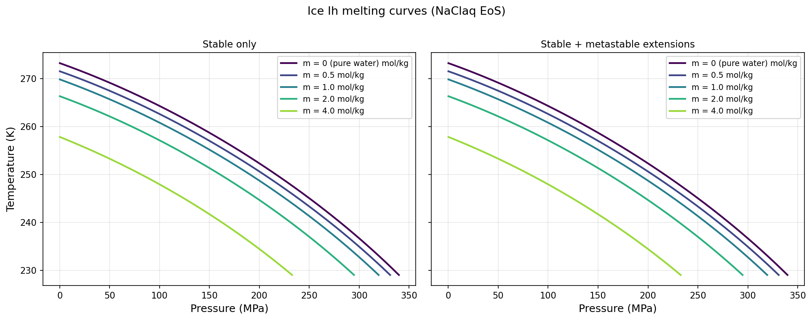
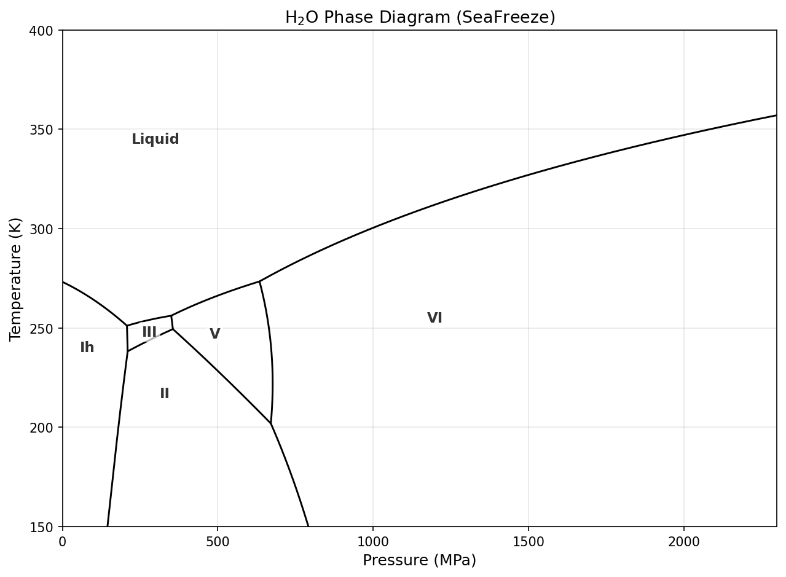

# SeaFreeze

V1.1.0

The SeaFreeze package allows to compute the thermodynamic and elastic properties of water and ice polymorphs (Ih, II, III, V, VI and ice VII/ice X) in the 0-100 GPa and 220-10000 K range, with the study of icy worlds and their ocean in mind. It is based on the evaluation of Gibbs Local Basis Functions parametrization (https://github.com/jmichaelb/LocalBasisFunction) for each phase. The formalism is described in more details in Brown (2018), Journaux et al. (2019), and in the liquid water Gibbs parametrization by Bollengier, Brown, and Shaw (2019). 


## Installation
This package will install SeaFreeze, LBFTD, and MLBspline and their dependencies.

Requires **Python ≥ 3.11**.

Run the following command to install:

```
pip install SeaFreeze
```

To upgrade to the latest version:

```
pip install --upgrade SeaFreeze
```


### `getProp`
Calculates thermodynamic and elastic properties of a phase of water or solution.

### Usage
The main function of SeaFreeze is `getProp`, which has the following parameters:
- `PT`: the pressure (MPa) and temperature (K) conditions at which the thermodynamic quantities should be
  calculated -- note that these are required units, as conversions are built into several calculations
  This parameter can have one of the following formats:
  - a 1-dimensional numpy array of tuples with one or more scattered (P,T) tuples 
  - a numpy array with 2 nested numpy arrays, the first with pressures and the second
    with temperatures -- each inner array must be sorted from low to high values
    a grid will be constructed from the P and T arrays such that each row of the output
    will correspond to a pressure and each column to a temperature 
- `phase`: indicates the phase of H₂O.  Supported phases are
  - `'Ih'` — ice Ih; Feistel & Wagner 2006
  - `'II'` — ice II; Journaux et al. 2020
  - `'III'` — ice III; Journaux et al. 2020
  - `'V'` — ice V; Journaux et al. 2020
  - `'VI'` — ice VI; Journaux et al. 2020
  - `'VII_X_French'` — ice VII / ice X; French & Redmer 2015
  - `'water1'` — liquid water ≤ 500 K, ≤ 2300 MPa; Bollengier et al. 2019 (**recommended** for 200–355 K)
  - `'water2'` — liquid water up to 100 GPa; Brown 2018
  - `'water_IAPWS95'` — IAPWS-95; Wagner & Pruss 2002
  - `'NaClaq'` — stitched LP+HP NaCl(aq), P=[0, 10001] MPa, T=[229, 2001] K (**recommended for NaCl**)
  - `'NaClaq_LP'` — 2026 low-P NaCl(aq) spline only, P=[0, 1001] MPa
  - `'NaClaq_HP'` — 2026 high-P NaCl(aq) spline only, P=[500, 10001] MPa
  - `'NaClaq_5GPa_2024'` — legacy Brown 2024 NaCl(aq) spline, P=[0, 5000] MPa

The output of `getProp` is a `SimpleNamespace` object whose attributes match those of the Matlab `SF_getprop` function exactly.

Pass `verbose=True` to print lbftd diagnostic warnings (e.g. extrapolation outside the spline domain); silent by default.

> **Deprecation note:** `seafreeze.seafreeze()` (the old function name) still works but emits a `DeprecationWarning` and will be removed after 2026-06-21. Use `getProp` instead.

**All phases** (pure water/ice and NaClaq):

| Quantity | Symbol | Unit |
| --- |:---:| :---:|
| Gibbs Energy | `G` | J/kg |
| Entropy | `S` | J/K/kg |
| Internal Energy | `U` | J/kg |
| Enthalpy | `H` | J/kg |
| Helmholtz free energy | `A` | J/kg |
| Density | `rho` | kg/m³ |
| Isobaric heat capacity | `Cp` | J/kg/K |
| Isochoric heat capacity | `Cv` | J/kg/K |
| Isothermal bulk modulus | `Kt` | MPa |
| Pressure derivative of Kt | `Kp` | − |
| Isentropic bulk modulus | `Ks` | MPa |
| Thermal expansivity | `alpha` | 1/K |
| Bulk sound speed | `vel` | m/s |
| Adiabatic temperature gradient | `Js` | K/MPa |
| Grüneisen parameter | `gamma_Gruneisen` | − |
| Pressure echo | `P` | MPa |
| Temperature echo | `T` | K |

**Solid ice phases additionally** (`Ih`, `II`, `III`, `V`, `VI`, `VII_X_French`):

| Quantity | Symbol | Unit |
| --- |:---:| :---:|
| Shear modulus | `shear` | MPa |
| P-wave velocity | `Vp` | m/s |
| S-wave velocity | `Vs` | m/s |

**NaClaq additionally** (`NaClaq`, `NaClaq_LP`, `NaClaq_HP`, `NaClaq_5GPa_2024`):

| Quantity | Symbol | Unit |
| --- |:---:| :---:|
| Solute chemical potential | `mus` | J/mol |
| Solvent (water) chemical potential | `muw` | J/mol |
| Partial molar volume of solute | `Va` | cm³/mol |
| Apparent molar heat capacity | `Cpa` | J/mol/K |
| Partial molar volume | `Vm` | cm³/mol |
| Partial molar volume of water | `Vw` | cm³/mol |
| Partial molar heat capacity | `Cpm` | J/mol/K |
| Osmotic coefficient | `phi` | − |
| Excess volume | `Vex` | cm³/mol |
| Water activity | `aw` | − |
| Molality echo | `m` | mol/kg |
| Solute mole fraction | `xs` | − |
| Solvent mole fraction | `xw` | − |
| Mass fraction factor | `f` | kg-soln/kg-H₂O |

**NaN values are returned for conditions outside the parametrization boundaries.**

### Example

```python
import numpy as np
from seafreeze import seafreeze as sf

# list supported phases
sf.phases.keys()

# evaluate thermodynamics for ice VI at 900 MPa and 255 K
PT = np.empty((1,), dtype='object')
PT[0] = (900, 255)
out = sf.getProp(PT, 'VI')
# view a couple of the calculated thermodynamic quantities at this P and T
out.rho     # density
out.Vp      # compressional wave velocity

# evaluate thermodynamics for water at three separate PT conditions
PT = np.empty((3,), dtype='object')
PT[0] = (441.0858, 313.95)
PT[1] = (478.7415, 313.96)
PT[2] = (444.8285, 313.78)
out = sf.getProp(PT, 'water1')
# values for output fields correspond positionally to (P,T) tuples 
out.H       # enthalpy

# evaluate ice V thermodynamics at pressures 400-500 MPa and temperatures 240-250 K
P = np.arange(400, 501, 2)
T = np.arange(240, 250.1, 0.5)
PT = np.array([P, T], dtype='object')
out = sf.getProp(PT, 'V')
# rows in output correspond to pressures; columns to temperatures
out.A       # Helmholtz energy
out.shear   # shear modulus
```


## `seafreeze.whichphase`: determining the stable phase of water

### Usage
SeaFreeze includes a function to determine which of the *supported* phases is stable
under the given pressure and temperature conditions.

```python
whichphase(PTm, solute='water1', path=defpath)
```

- `PTm` — same format as `getProp` (`PT` for pure water, `PTm` for NaCl solutions)
- `solute` — optional; set to `'NaCl'` to use NaClaq as the liquid phase, enabling freezing-point-depression phase maps; `PTm` then requires a molality axis `[P, T, m]`

The output is a NumPy array of integers: 0 = liquid, 1 = ice Ih, 2 = II, 3 = III, 5 = V, 6 = VI; `numpy.nan` outside all parametrizations.
- Scattered (P,T): each value corresponds to the same index in the input
- Grid: each row corresponds to a pressure and each column to a temperature

`phasenum2phase(phaseInt)` converts an integer phase number back to a material string.

### Example

```python
import numpy as np
from seafreeze import seafreeze as sf

# determine the phase of water at 900 MPa and 255 K
PT = np.empty((1,), dtype=object)
PT[0] = (900, 255)
out = sf.whichphase(PT)
# map to a phase using phasenum2phase
sf.phasenum2phase(out[0])

# determine phase for three separate (P,T) conditions
PT = np.empty((3,), dtype=object)
PT[0] = (100, 200)
PT[1] = (400, 250)
PT[2] = (1000, 300)
out = sf.whichphase(PT)
# show phase for each (P,T)
[(pt, sf.phasenum2phase(pn)) for (pt, pn) in zip(PT, out)]

# find the likely phases at pressures 0-5 MPa and temperatures 240-300 K
P = np.arange(0, 5, 0.1)
T = np.arange(240, 300)
PT = np.array([P, T], dtype=object)
out = sf.whichphase(PT)

# phase map for a 2 mol/kg NaCl solution (freezing-point depression)
PTm = np.array([np.arange(0, 500, 10), np.arange(240, 300, 0.6),
                np.full(50, 2.0)], dtype=object)
out = sf.whichphase(PTm, solute='NaCl')
```

---

## Phase boundaries: `seafreeze.phaselines`

SeaFreeze 1.1.0 adds a dedicated module for computing and plotting phase boundary curves — the equilibrium (P, T) loci between any two supported phases.  It is the Python equivalent of the Matlab `SF_PhaseLines` / `SF_WPD` stack.

### Public API

| Function | Returns | Description |
|---|---|---|
| `phase_range(material)` | `PhaseRange(P, T, m)` | Knot-domain bounds of the Gibbs spline for one material |
| `phase_lines(matA, matB, …)` | `PhaseLineResult` (or list) | Equilibrium (P, T) curve between two phases |
| `wpd(…)` | `matplotlib.figure.Figure` | Full water phase diagram plot |

**`phase_lines` parameters**

| Parameter | Default | Description |
|---|---|---|
| `matA`, `matB` | — | Phase names (same as `getProp`; order does not matter) |
| `m` | `None` | Molality (mol/kg) — required when one phase is `'NaClaq'`; accepts a scalar or list; `m=0` gives the pure-water limit via the NaClaq EoS |
| `T` | auto | 1-D array of temperatures (K) to use as the evaluation grid |
| `segment` | `'all'` | `'all'`, `'stable'`, or `'meta'` — which part of the curve to return |

The `PhaseLineResult` object has attributes `matA`, `matB`, `P` (MPa), `T` (K), `stable` (bool mask), `segment`, and `m`.

**`wpd` parameters**

| Parameter | Default | Description |
|---|---|---|
| `ax` | `None` (new figure) | Matplotlib Axes to plot onto; creates a new figure if omitted |
| `solute` | `'none'` | `'NaCl'` to overlay NaClaq melting curves |
| `m` | `None` | Molality list for the NaCl overlay |
| `show_meta` | `True` | Show metastable extensions as dashed gray lines |
| `phase_labels` | `False` | Annotate phase fields (Ih, II, III, V, VI, Liquid) |

### Example — Ice Ih melting curves with NaCl

`m=0` uses the NaClaq EoS at the pure-water limit. Higher concentration depresses the melting temperature across the entire pressure range.

```python
import matplotlib.pyplot as plt
import matplotlib.cm as cm
import numpy as np
from seafreeze.phaselines import phase_lines

m_vals   = [0.0, 0.5, 1.0, 2.0, 4.0]
m_labels = ['0 (pure water)', '0.5', '1.0', '2.0', '4.0']
colors   = cm.viridis(np.linspace(0.0, 0.85, len(m_vals)))

fig, ax = plt.subplots(figsize=(7, 5))
for m, lbl, c in zip(m_vals, m_labels, colors):
    r = phase_lines('Ih', 'NaClaq', m=m, segment='stable')
    ax.plot(r.P, r.T, '-', color=c, lw=2, label=f'm = {lbl} mol/kg')
ax.set_xlabel('Pressure (MPa)')
ax.set_ylabel('Temperature (K)')
ax.set_title('Ice Ih melting curves (NaClaq EoS)')
ax.legend(fontsize=9)
ax.grid(True, alpha=0.3)
plt.tight_layout()
plt.show()
```



### Example — Full pure-water phase diagram

Use `show_meta=False` to hide metastable extensions and `phase_labels=True` to annotate each stability field.

```python
from seafreeze.phaselines import wpd

with warnings.catch_warnings():
    warnings.simplefilter('ignore')
    fig = wpd(show_meta=False, phase_labels=True)
plt.show()
```

`wpd` also accepts a `solute='NaCl'` keyword together with a list of molalities to overlay NaCl melting curves on the diagram:

```python
fig = wpd(show_meta=False, phase_labels=True, solute='NaCl', m=[0.5, 2.0, 4.0])
```



---

## Important remarks 
### Water representation
The ice Gibbs parametrizations are optimized to be used with `water1` (Bollengier et al. 2019), particularly for phase-equilibrium calculations. Using other water parametrizations will lead to incorrect melting curves. `water2` (Brown 2018) and `water_IAPWS95` (IAPWS-95) are provided for high-pressure extension (up to 100 GPa) and comparison only. The authors recommend `water1` for any application in the 200–355 K range and up to 2300 MPa.

### Range of validity
SeaFreeze stability prediction is currently considered valid down to 130K, which correspond to the ice VI - ice XV transition. The ice Ih - II transition is potentially valid down to 73.4 K (ice Ih - ice XI transition). The ice VII and ice X representation extend to 1TPa (1e6 MPa) and 2000K.

## References
- [Bollengier, Brown and Shaw (2019) J. Chem. Phys. 151, 054501; doi: 10.1063/1.5097179](https://aip.scitation.org/doi/abs/10.1063/1.5097179)
- [Brown (2018) Fluid Phase Equilibria 463, pp. 18-31](https://www.sciencedirect.com/science/article/pii/S0378381218300530)
- [Feistel and Wagner (2006), J. Phys. Chem. Ref. Data 35, pp. 1021-1047](https://aip.scitation.org/doi/abs/10.1063/1.2183324)
- [Journaux et al. (2020) JGR: Planets 125, e2019JE006176](https://agupubs.onlinelibrary.wiley.com/doi/10.1029/2019JE006176)
- [Wagner and Pruss (2002), J. Phys. Chem. Ref. Data 31, pp. 387-535](https://aip.scitation.org/doi/abs/10.1063/1.1461829)
- [French and Redmer (2015), Physical Review B 91, 014308](http://link.aps.org/doi/10.1103/PhysRevB.91.014308)

## Authors

* **Baptiste Journaux** - *University of Washington, Earth and Space Sciences Department, Seattle, USA* 
* **J. Michael Brown** - *University of Washington, Earth and Space Sciences Department, Seattle, USA* 
* **Penny Espinoza** - *University of Washington, Earth and Space Sciences Department, Seattle, USA* 
* **Erica Clinton** - *University of Washington, Earth and Space Sciences Department, Seattle, USA* 
* **Tyler Gordon** - *University of Washington, Department of Astronomy, Seattle, USA*
* **Ula Jones** - *University of Washington, Earth and Space Sciences Department, Seattle, USA*

## Change log

### Changes since 0.9.0
- `1.1.0`: added `seafreeze.phaselines` module — phase boundary computation (`phase_lines`, `phase_range`) and the full water phase diagram plotter (`wpd`); NaClaq melting curves for Ih, II, III, V, and VI; cross-validated against the Matlab SF_PhaseLines implementation to < 0.01 K. `getProp` output now matches Matlab `SF_getprop` exactly: added `Js`, `gamma_Gruneisen`, `P`/`T` echoes, NaClaq mixing properties (`m`, `xs`, `xw`, `f`, `Vw`); removed Python-only `V`, `gam`, `Gex` from default output; individual per-spline `.mat` files replace the monolithic spline archive.
- `1.0`: added NaCl aqueous solution EOS and concentration dependent thermodynamic variables.
- `0.9.4`: Adjusted python readme syntax and package authorship info
- `0.9.3`: add ice VII and ice X from French and Redmer (2015). LocalBasisFunction spline interpretation software integrated into SeaFreeze Python package. Adjusted packaging to work better with pip
- `0.9.2.post2`: `whichphase` returns `numpy.nan` if PT is outside the regime of all phases
- `0.9.2`: add ice II to the representation.
- `0.9.1`: add `whichphase` function

### Changes from 0.8
- rename function get_phase_thermodynamics to seafreeze
- reverse order of PT and phase in function signature
- remove a layer of nesting (`seafreeze.seafreeze` rather than `seafreeze.seafreeze.seafreeze`)


## License

SeaFreeze is licensed under the GPL-3 License :

Copyright (c) 2019, B. Journaux

This program is free software: you can redistribute it and/or modify
    it under the terms of the GNU General Public License as published by
    the Free Software Foundation, version 3.
    
This program is distributed in the hope that it will be useful,
    but WITHOUT ANY WARRANTY; without even the implied warranty of
    MERCHANTABILITY or FITNESS FOR A PARTICULAR PURPOSE.  See the
    GNU General Public License for more details.

 You should have received a copy of the GNU General Public License
    along with this program.  If not, see <https://www.gnu.org/licenses/>.

THERE IS NO WARRANTY FOR THE PROGRAM, TO THE EXTENT PERMITTED BY
APPLICABLE LAW.  EXCEPT WHEN OTHERWISE STATED IN WRITING THE COPYRIGHT
HOLDERS AND/OR OTHER PARTIES PROVIDE THE PROGRAM "AS IS" WITHOUT WARRANTY
OF ANY KIND, EITHER EXPRESSED OR IMPLIED, INCLUDING, BUT NOT LIMITED TO,
THE IMPLIED WARRANTIES OF MERCHANTABILITY AND FITNESS FOR A PARTICULAR
PURPOSE.  THE ENTIRE RISK AS TO THE QUALITY AND PERFORMANCE OF THE PROGRAM
IS WITH YOU.  SHOULD THE PROGRAM PROVE DEFECTIVE, YOU ASSUME THE COST OF
ALL NECESSARY SERVICING, REPAIR OR CORRECTION.

## Acknowledgments

This work was produced with the financial support provided by the NASA Postdoctoral Program fellowship, by the NASA Solar System Workings Grant 80NSSC17K0775 and by the Icy Worlds node of NASA's Astrobiology Institute (08-NAI5-0021).

Illustration montage uses pictures from NASA Galileo and Cassini spacecrafts (from top to bottom: Enceladus, Europa and Ganymede). Terrestrial sea ice picture use with the authorization of the author [Rowan Romeyn](https://arcex.no/meet-rowan-romeyn-a-new-arcex-phd-student/).
