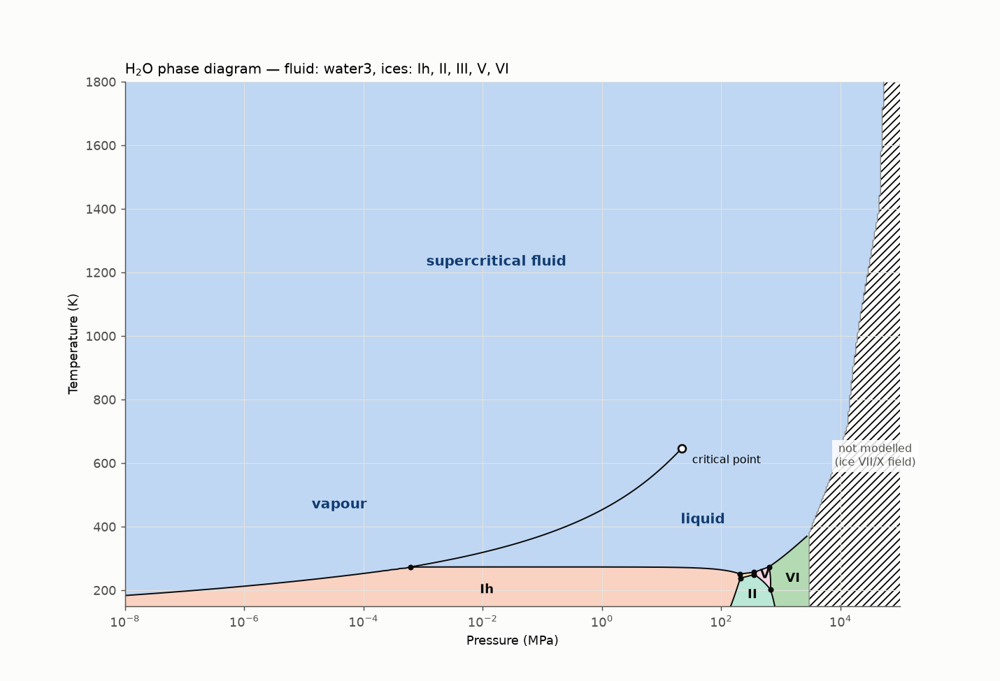
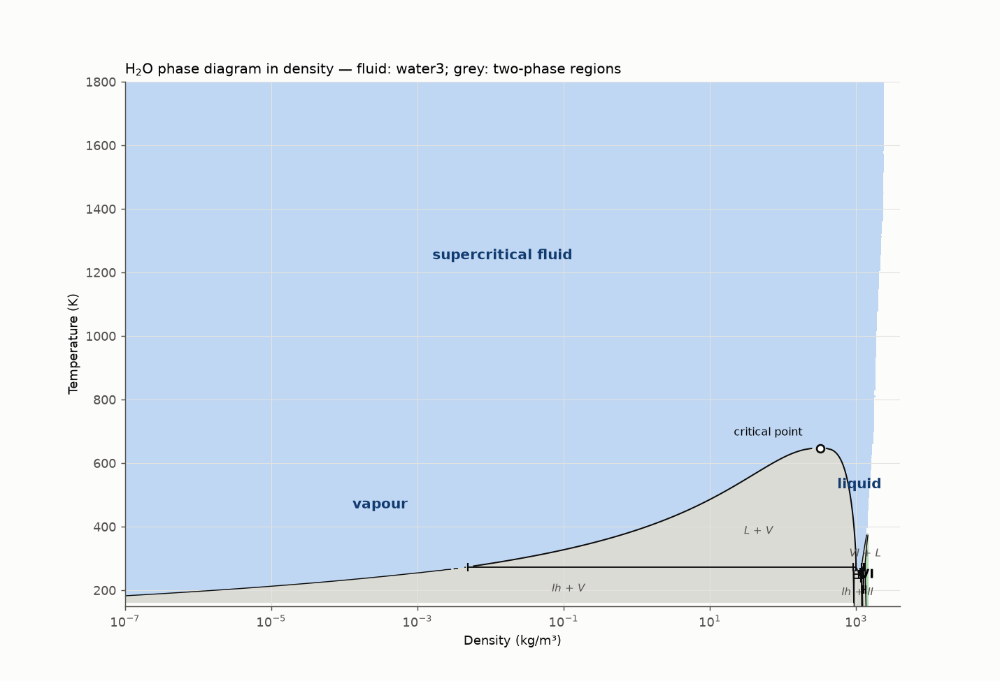
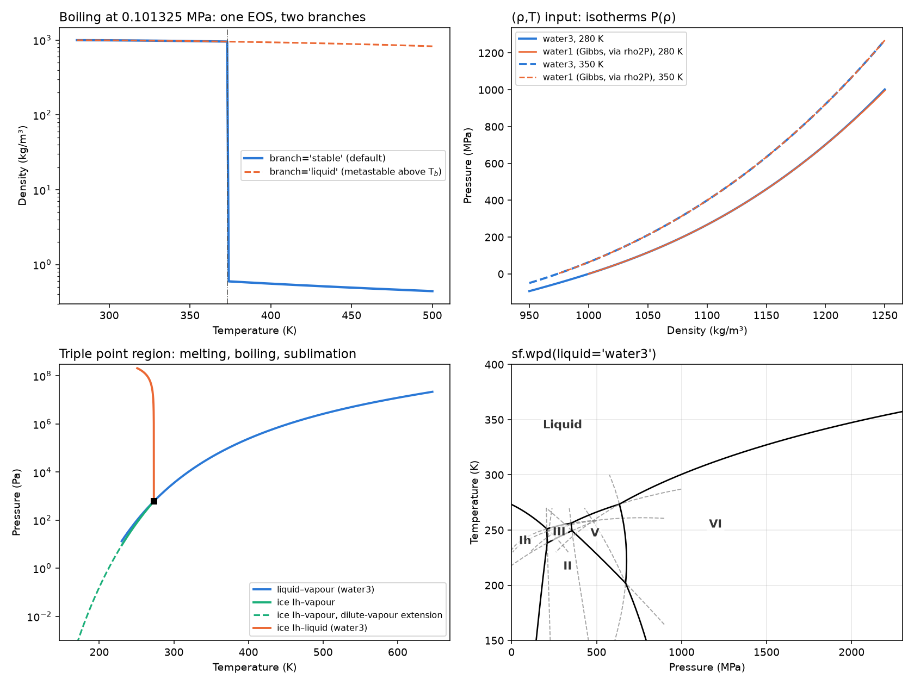
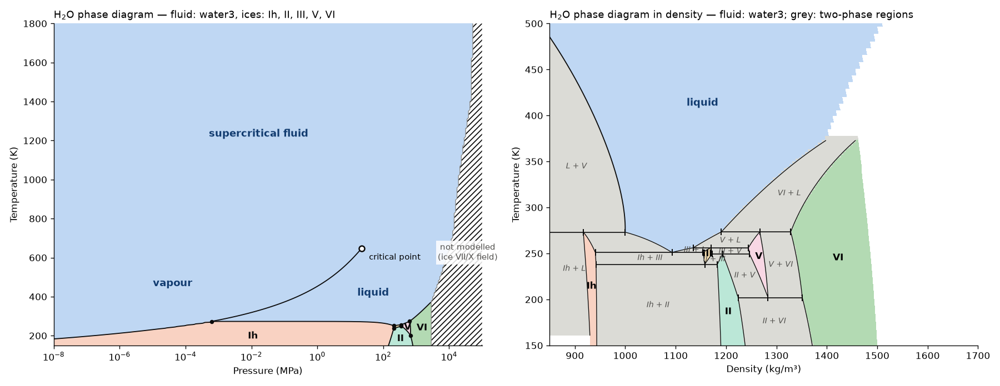
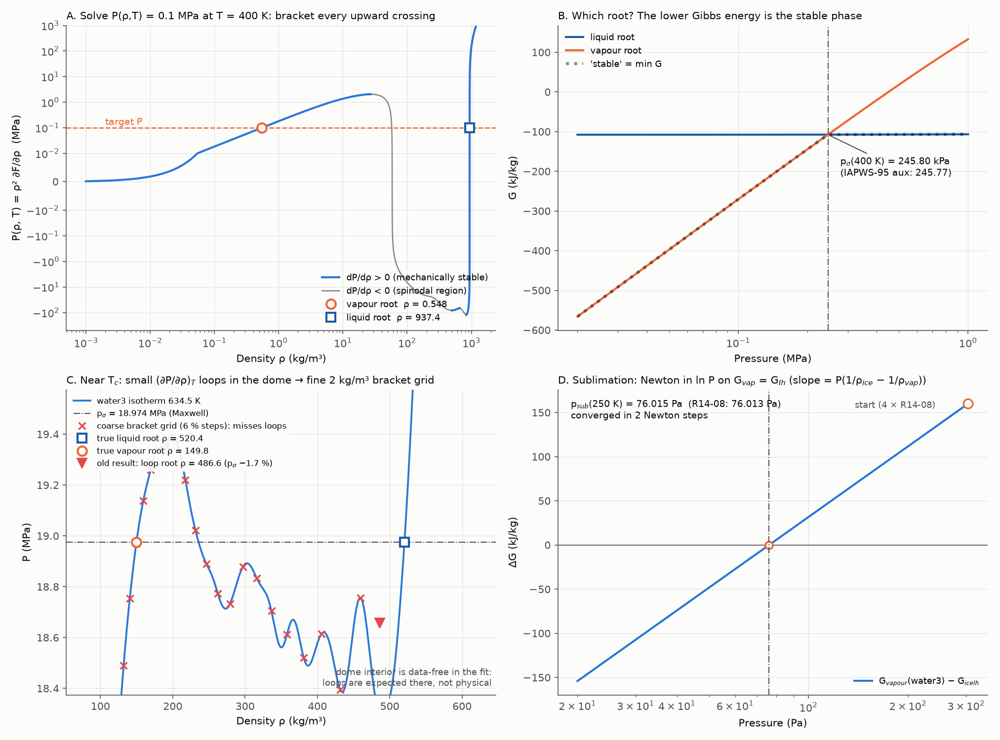
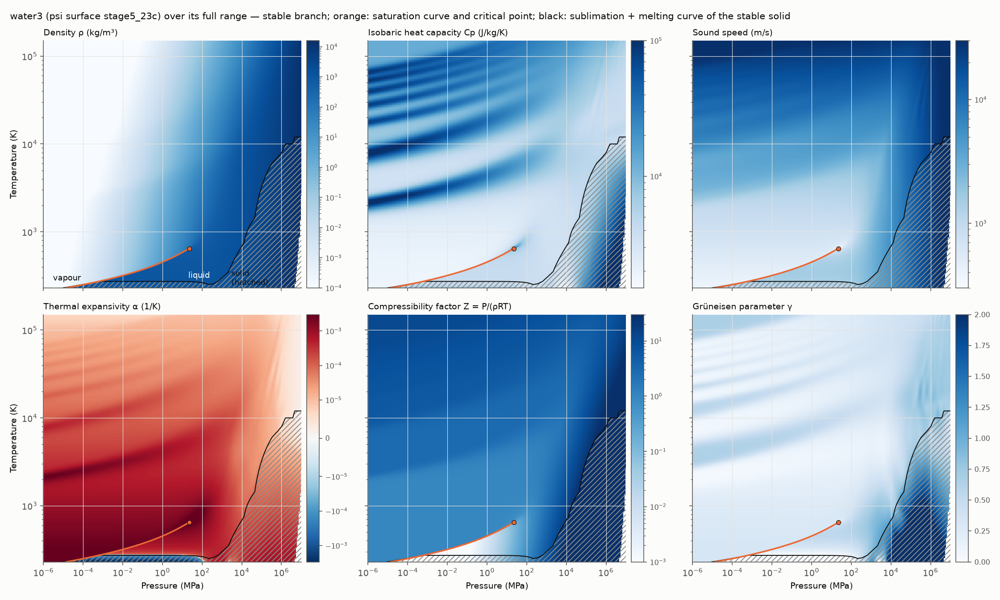

# SeaFreeze

V1.2 beta (`1.2.0b1`)

The SeaFreeze package allows to compute the thermodynamic and elastic properties of water and ice polymorphs (Ih, II, III, V, VI and ice VII/ice X) in the 0-100 GPa and 220-10000 K range, with the study of icy worlds and their ocean in mind. Since 1.2 it also includes `water_Brown2026`, fluid water from a Helmholtz energy surface covering vapour, liquid and supercritical states (230 K – 150 000 K, dilute vapour to 16 000 kg/m³), with liquid–vapour and ice–vapour equilibria and full phase diagrams in (P,T) and (ρ,T). It is based on the evaluation of Gibbs Local Basis Functions parametrization (https://github.com/jmichaelb/LocalBasisFunction) for each phase. The formalism is described in more details in Brown (2018), Journaux et al. (2019), and in the liquid water Gibbs parametrization by Bollengier, Brown, and Shaw (2019). 


## What's new in 1.2 beta
- **Clearer material names** — `water1`, `water2`, `water3` are now `water_Bollengier2019`, `water_Brown2018`, `water_Brown2026`; `NaClaq_LP`, `NaClaq_HP`, `NaClaq_5GPa_2024` are now `NaClaq_Brown2026_LP`, `NaClaq_Brown2026_HP`, `NaClaq_Brown2024` (`NaClaq` stays a shortcut for `NaClaq_Brown2026`); the old names still work through 1.x with a once-per-session warning (see *Renamed materials*).
- **`water_Brown2026`** — Helmholtz-energy fluid water (vapour, liquid, supercritical) from the psi-spline surface *stage5_23c*; stable / liquid / vapour branch selection at (P,T). See [`water_Brown2026`](#water_brown2026-helmholtz-energy-fluid-water-new-in-12-beta).
- **Density input for every material** — `getProp(..., rhoT=True)`: (ρ,T) or (ρ,T,m) points; Gibbs splines are inverted with `rho2P`.
- **Vapour equilibria** — `saturation(T)` and `sublimation(T)`, with a dilute-vapour extension below 230 K (on by default, warns once per session).
- **Full phase diagrams** — `wpd_PT`, `wpd_rhoT`, `phase_map`, `triple_points`, `melt_T_dq2026`: vapour, liquid, supercritical fluid, critical point and ices, with two-phase regions and triple-point tie lines in (ρ,T).
- **`water_Brown2026` in the phase-boundary tools** — `whichphase(PTm, 'water_Brown2026')`, `phase_lines(ice, 'water_Brown2026')`, `wpd(liquid='water_Brown2026')`.
- **Fixes** — grids whose P and T vectors have the same length crashed the Gibbs evaluator; splines whose knot vectors have the same length were mis-loaded.
- The Matlab version runs unmodified under GNU Octave.

## Installation
This package will install SeaFreeze, LBFTD, and MLBspline and their dependencies.

Requires **Python ≥ 3.11**.

Run the following command to install:

```
pip install SeaFreeze
```

To upgrade to the latest version:

```
pip install --upgrade SeaFreeze
```


### `getProp`
Calculates thermodynamic and elastic properties of a phase of water or solution.

### Usage
The main function of SeaFreeze is `getProp`, which has the following parameters:
- `PT`: the pressure (MPa) and temperature (K) conditions at which the thermodynamic quantities should be
  calculated -- note that these are required units, as conversions are built into several calculations
  This parameter can have one of the following formats:
  - a 1-dimensional numpy array of tuples with one or more scattered (P,T) tuples 
  - a numpy array with 2 nested numpy arrays, the first with pressures and the second
    with temperatures -- each inner array must be sorted from low to high values
    a grid will be constructed from the P and T arrays such that each row of the output
    will correspond to a pressure and each column to a temperature 
- `phase`: indicates the phase of H₂O.  Supported phases are
  - `'Ih'` — ice Ih; Feistel & Wagner 2006
  - `'II'` — ice II; Journaux et al. 2020
  - `'III'` — ice III; Journaux et al. 2020
  - `'V'` — ice V; Journaux et al. 2020
  - `'VI'` — ice VI; Journaux et al. 2020
  - `'VII_X_French'` — ice VII / ice X; French & Redmer 2015
  - `'water_Bollengier2019'` — liquid water ≤ 500 K, ≤ 2300 MPa; Bollengier et al. 2019 (**recommended** for 200–355 K)
  - `'water_Brown2018'` — liquid water up to 100 GPa; Brown 2018
  - `'water_IAPWS95'` — IAPWS-95; Wagner & Pruss 2002
  - `'water_Brown2026'` — fluid water (vapour, liquid, supercritical) from a Helmholtz energy surface F(ρ,T), 230 K – 150 000 K (**new in 1.2**, see [`water_Brown2026`](#water_brown2026-helmholtz-energy-fluid-water-new-in-12-beta))
  - `'NaClaq_Brown2026'` — stitched LP+HP NaCl(aq), P=[0, 10001] MPa, T=[229, 2001] K (**recommended for NaCl**; shortcut `'NaClaq'`)
  - `'NaClaq_Brown2026_LP'` — 2026 low-P NaCl(aq) spline only, P=[0, 1001] MPa
  - `'NaClaq_Brown2026_HP'` — 2026 high-P NaCl(aq) spline only, P=[500, 10001] MPa
  - `'NaClaq_Brown2024'` — legacy Brown 2024 NaCl(aq) spline, P=[0, 5000] MPa

**Renamed materials (1.2).** The numbered water names and the NaCl(aq) names are replaced by author–year names. The old names keep working throughout SeaFreeze 1.x: they are mapped to the new name with a `seafreeze.SeaFreezeDeprecationWarning` (a `FutureWarning`, shown by default), shown once per session for each old name, and give identical results. They will be removed in SeaFreeze 2.0. Functions that return material names (e.g. `phasenum2phase`, phase-diagram labels) return the new names. Silence the warning with `warnings.filterwarnings('ignore', category=sf.SeaFreezeDeprecationWarning)`.

| Old name | New name | Equation of state |
|---|---|---|
| `water1` | `water_Bollengier2019` | liquid water, Bollengier et al. 2019 (≤ 500 K, ≤ 2300 MPa) |
| `water2` | `water_Brown2018` | liquid water, Brown 2018 (to 100 GPa) |
| `water3` | `water_Brown2026` | fluid water (vapour, liquid, supercritical), Helmholtz surface, Brown & Journaux 2026 |
| `water_IAPWS95` | `water_IAPWS95` (unchanged) | IAPWS-95, Wagner & Pruss 2002 |
| `NaClaq_LP` | `NaClaq_Brown2026_LP` | NaCl(aq) low-P spline, Brown 2026 |
| `NaClaq_HP` | `NaClaq_Brown2026_HP` | NaCl(aq) high-P spline, Brown 2026 |
| `NaClaq_5GPa_2024` | `NaClaq_Brown2024` | NaCl(aq) to 5 GPa, Brown 2024 (legacy) |
| `NaClaq` | `NaClaq_Brown2026` | stitched LP+HP NaCl(aq), Brown 2026 — **`NaClaq` stays a permanent shortcut** (no warning) for the recommended NaCl(aq) model |

The output of `getProp` is a `SimpleNamespace` object whose attributes match those of the Matlab `SF_getprop` function exactly.

Keyword arguments:
- `rhoT=True` — the first coordinate of `PT` is density (kg/m³) instead of pressure; P is returned. Works for every material (Gibbs splines are inverted with `rho2P`).
- `branch='stable' | 'liquid' | 'vapor'` — Helmholtz materials (`water_Brown2026`) only: which fluid root to return at (P,T).

Pass `verbose=True` to print lbftd diagnostic warnings (e.g. extrapolation outside the spline domain); silent by default.

> **Deprecation note:** `seafreeze.seafreeze()` (the old function name) still works but emits a `DeprecationWarning` and will be removed after 2026-06-21. Use `getProp` instead.

**All phases** (pure water/ice and NaClaq):

| Quantity | Symbol | Unit |
| --- |:---:| :---:|
| Gibbs Energy | `G` | J/kg |
| Entropy | `S` | J/K/kg |
| Internal Energy | `U` | J/kg |
| Enthalpy | `H` | J/kg |
| Helmholtz free energy | `A` | J/kg |
| Density | `rho` | kg/m³ |
| Isobaric heat capacity | `Cp` | J/kg/K |
| Isochoric heat capacity | `Cv` | J/kg/K |
| Isothermal bulk modulus | `Kt` | MPa |
| Pressure derivative of Kt | `Kp` | − |
| Isentropic bulk modulus | `Ks` | MPa |
| Thermal expansivity | `alpha` | 1/K |
| Bulk sound speed | `vel` | m/s |
| Adiabatic temperature gradient | `Js` | K/MPa |
| Grüneisen parameter | `gamma_Gruneisen` | − |
| Pressure echo | `P` | MPa |
| Temperature echo | `T` | K |

**Solid ice phases additionally** (`Ih`, `II`, `III`, `V`, `VI`, `VII_X_French`):

| Quantity | Symbol | Unit |
| --- |:---:| :---:|
| Shear modulus | `shear` | MPa |
| P-wave velocity | `Vp` | m/s |
| S-wave velocity | `Vs` | m/s |

**NaClaq additionally** (`NaClaq_Brown2026`, `NaClaq_Brown2026_LP`, `NaClaq_Brown2026_HP`, `NaClaq_Brown2024`):

| Quantity | Symbol | Unit |
| --- |:---:| :---:|
| Solute chemical potential | `mus` | J/mol |
| Solvent (water) chemical potential | `muw` | J/mol |
| Partial molar volume of solute | `Va` | cm³/mol |
| Apparent molar heat capacity | `Cpa` | J/mol/K |
| Partial molar volume | `Vm` | cm³/mol |
| Partial molar volume of water | `Vw` | cm³/mol |
| Partial molar heat capacity | `Cpm` | J/mol/K |
| Osmotic coefficient | `phi` | − |
| Excess volume | `Vex` | cm³/mol |
| Water activity | `aw` | − |
| Molality echo | `m` | mol/kg |
| Solute mole fraction | `xs` | − |
| Solvent mole fraction | `xw` | − |
| Mass fraction factor | `f` | kg-soln/kg-H₂O |

**NaN values are returned for conditions outside the parametrization boundaries.**

### Example

```python
import numpy as np
from seafreeze import seafreeze as sf

# list supported phases
sf.phases.keys()

# evaluate thermodynamics for ice VI at 900 MPa and 255 K
PT = np.empty((1,), dtype='object')
PT[0] = (900, 255)
out = sf.getProp(PT, 'VI')
# view a couple of the calculated thermodynamic quantities at this P and T
out.rho     # density
out.Vp      # compressional wave velocity

# evaluate thermodynamics for water at three separate PT conditions
PT = np.empty((3,), dtype='object')
PT[0] = (441.0858, 313.95)
PT[1] = (478.7415, 313.96)
PT[2] = (444.8285, 313.78)
out = sf.getProp(PT, 'water_Bollengier2019')
# values for output fields correspond positionally to (P,T) tuples 
out.H       # enthalpy

# evaluate ice V thermodynamics at pressures 400-500 MPa and temperatures 240-250 K
P = np.arange(400, 501, 2)
T = np.arange(240, 250.1, 0.5)
PT = np.array([P, T], dtype='object')
out = sf.getProp(PT, 'V')
# rows in output correspond to pressures; columns to temperatures
out.A       # Helmholtz energy
out.shear   # shear modulus
```


## `seafreeze.whichphase`: determining the stable phase of water

### Usage
SeaFreeze includes a function to determine which of the *supported* phases is stable
under the given pressure and temperature conditions.

```python
whichphase(PTm, solute='water_Bollengier2019', path=defpath)
```

- `PTm` — same format as `getProp` (`PT` for pure water, `PTm` for NaCl solutions)
- `solute` — optional; set to `'NaCl'` to use NaClaq as the liquid phase, enabling freezing-point-depression phase maps; `PTm` then requires a molality axis `[P, T, m]`

The output is a NumPy array of integers: 0 = liquid, 1 = ice Ih, 2 = II, 3 = III, 5 = V, 6 = VI; `numpy.nan` outside all parametrizations.
- Scattered (P,T): each value corresponds to the same index in the input
- Grid: each row corresponds to a pressure and each column to a temperature

`phasenum2phase(phaseInt)` converts an integer phase number back to a material string.

### Example

```python
import numpy as np
from seafreeze import seafreeze as sf

# determine the phase of water at 900 MPa and 255 K
PT = np.empty((1,), dtype=object)
PT[0] = (900, 255)
out = sf.whichphase(PT)
# map to a phase using phasenum2phase
sf.phasenum2phase(out[0])

# determine phase for three separate (P,T) conditions
PT = np.empty((3,), dtype=object)
PT[0] = (100, 200)
PT[1] = (400, 250)
PT[2] = (1000, 300)
out = sf.whichphase(PT)
# show phase for each (P,T)
[(pt, sf.phasenum2phase(pn)) for (pt, pn) in zip(PT, out)]

# find the likely phases at pressures 0-5 MPa and temperatures 240-300 K
P = np.arange(0, 5, 0.1)
T = np.arange(240, 300)
PT = np.array([P, T], dtype=object)
out = sf.whichphase(PT)

# phase map for a 2 mol/kg NaCl solution (freezing-point depression)
PTm = np.array([np.arange(0, 500, 10), np.arange(240, 300, 0.6),
                np.full(50, 2.0)], dtype=object)
out = sf.whichphase(PTm, solute='NaCl')
```

---

## Phase boundaries: `seafreeze.phaselines`

SeaFreeze 1.1.0 adds a dedicated module for computing and plotting phase boundary curves — the equilibrium (P, T) loci between any two supported phases.  It is the Python equivalent of the Matlab `SF_PhaseLines` / `SF_WPD` stack.

### Public API

| Function | Returns | Description |
|---|---|---|
| `phase_range(material)` | `PhaseRange(P, T, m)` | Knot-domain bounds of the Gibbs spline for one material |
| `phase_lines(matA, matB, …)` | `PhaseLineResult` (or list) | Equilibrium (P, T) curve between two phases |
| `wpd(…)` | `matplotlib.figure.Figure` | Full water phase diagram plot |

**`phase_lines` parameters**

| Parameter | Default | Description |
|---|---|---|
| `matA`, `matB` | — | Phase names (same as `getProp`; order does not matter) |
| `m` | `None` | Molality (mol/kg) — required when one phase is `'NaClaq_Brown2026'`; accepts a scalar or list; `m=0` gives the pure-water limit via the NaClaq EoS |
| `T` | auto | 1-D array of temperatures (K) to use as the evaluation grid |
| `segment` | `'all'` | `'all'`, `'stable'`, or `'meta'` — which part of the curve to return |

The `PhaseLineResult` object has attributes `matA`, `matB`, `P` (MPa), `T` (K), `stable` (bool mask), `segment`, and `m`.

**`wpd` parameters**

| Parameter | Default | Description |
|---|---|---|
| `ax` | `None` (new figure) | Matplotlib Axes to plot onto; creates a new figure if omitted |
| `solute` | `'none'` | `'NaCl'` to overlay NaClaq melting curves |
| `m` | `None` | Molality list for the NaCl overlay |
| `show_meta` | `True` | Show metastable extensions as dashed gray lines |
| `phase_labels` | `False` | Annotate phase fields (Ih, II, III, V, VI, Liquid) |

### Example — Ice Ih melting curves with NaCl

`m=0` uses the NaClaq EoS at the pure-water limit. Higher concentration depresses the melting temperature across the entire pressure range.

```python
import matplotlib.pyplot as plt
import matplotlib.cm as cm
import numpy as np
from seafreeze.phaselines import phase_lines

m_vals   = [0.0, 0.5, 1.0, 2.0, 4.0]
m_labels = ['0 (pure water)', '0.5', '1.0', '2.0', '4.0']
colors   = cm.viridis(np.linspace(0.0, 0.85, len(m_vals)))

fig, ax = plt.subplots(figsize=(7, 5))
for m, lbl, c in zip(m_vals, m_labels, colors):
    r = phase_lines('Ih', 'NaClaq_Brown2026', m=m, segment='stable')
    ax.plot(r.P, r.T, '-', color=c, lw=2, label=f'm = {lbl} mol/kg')
ax.set_xlabel('Pressure (MPa)')
ax.set_ylabel('Temperature (K)')
ax.set_title('Ice Ih melting curves (NaClaq EoS)')
ax.legend(fontsize=9)
ax.grid(True, alpha=0.3)
plt.tight_layout()
plt.show()
```


### Example — Full pure-water phase diagram

Use `show_meta=False` to hide metastable extensions and `phase_labels=True` to annotate each stability field.

```python
from seafreeze.phaselines import wpd

with warnings.catch_warnings():
    warnings.simplefilter('ignore')
    fig = wpd(show_meta=False, phase_labels=True)
plt.show()
```

`wpd` also accepts a `solute='NaCl'` keyword together with a list of molalities to overlay NaCl melting curves on the diagram:

```python
fig = wpd(show_meta=False, phase_labels=True, solute='NaCl', m=[0.5, 2.0, 4.0])
```


---

## EOS inversion: `seafreeze.rho2P`

`rho2P` inverts the SeaFreeze EOS to find pressure P (MPa) such that `rho(P, T) == rho_target` for any supported material. Uses Newton-Raphson with the isothermal bulk modulus `Kt` and a bisection fallback for robustness; returns `NaN` where no solution exists within the spline domain.

### Signature

```python
from seafreeze import rho2P

P = rho2P(rho_target, T, phase)
P = rho2P(rho_target, T, phase, m=1.0)          # NaClaq: molality in mol/kg
P = rho2P(rho_target, T, phase, P0=500.0)        # optional initial guess (MPa)
P = rho2P(rho_target, T, phase, tol=1e-4)        # convergence tolerance (default 0.01 MPa)
```

| Parameter | Description |
|---|---|
| `rho_target` | Target density in kg/m³ — scalar or array-like |
| `T` | Temperature in K — scalar broadcasts against `rho_target` |
| `phase` | Any material code accepted by `getProp` |
| `m` | Molality in mol/kg — required for NaClaq phases |
| `P0` | Optional initial pressure guess in MPa |
| `tol` | Convergence tolerance in MPa (default `0.01`) |

Returns a NumPy array of the same shape as `rho_target`. `NaN` is returned where no solution was found (density out of range at the given T, or T outside the spline domain).

### Example

```python
import numpy as np
from seafreeze import rho2P

# Compressed liquid water
P = rho2P(1100.0, 300.0, 'water_Bollengier2019')         # ≈ 300 MPa

# Ice Ih
P = rho2P(930.0, 255.0, 'Ih')              # ≈ 104 MPa

# Ice VI — three scatter points
P = rho2P([1310., 1350., 1390.], [255., 260., 265.], 'VI')

# NaClaq at 1 mol/kg
P = rho2P(1050.0, 300.0, 'NaClaq_Brown2026', m=1.0)

# Round-trip check: compute rho with getProp, recover P with rho2P
import numpy as np, warnings
from seafreeze import getProp, rho2P
PTm = np.empty(1, dtype=object); PTm[0] = (500., 300.)
rho = getProp(PTm, 'water_Bollengier2019').rho.flat[0]
P_rec = rho2P(rho, 300., 'water_Bollengier2019')         # should recover ≈ 500 MPa
```

---

---

## `water_Brown2026`: Helmholtz-energy fluid water (new in 1.2 beta)

`water_Brown2026` is fluid water — vapour, liquid and supercritical fluid — from a Helmholtz energy surface F(ρ,T): the
psi-spline surface *stage5_23c* (J. M. Brown & B. Journaux, lbf-thermo 2026; the Hugoniot-favoured variant of the stage 23 release). Unlike the other SeaFreeze phases it is
not a Gibbs spline G(P,T): the residual Helmholtz energy is a tensor B-spline in (ln ρ, ln T) plus analytic ideal-gas,
reacting-mixture, critical (KW2000) and low-temperature two-structure terms. It shares the IAPWS-95 reference state
with the ice splines, so it can be used with them for phase equilibria.

At (P,T) SeaFreeze solves P = ρ²∂F/∂ρ for the density and returns the **stable** branch (lower Gibbs energy: vapour
below the saturation pressure, liquid above); `branch='liquid'` or `'vapor'` returns the metastable branch instead.

### Range of validity

| | water_Brown2026 range |
|---|---|
| Temperature | 230 K – 150 000 K (surface knots). Below 230 K only the dilute vapour is available, through the ideal-gas extension used by the sublimation curve and the phase diagrams |
| Density | up to 16 000 kg/m³; below 10⁻⁴ kg/m³ the surface is continued by a virial form and a low-density chemistry table |
| Pressure | from the dilute vapour to ~10 TPa (P = ρ²∂F/∂ρ over the box) |
| Phases | vapour, liquid, supercritical fluid; at (P,T) the stable branch (lower Gibbs energy; as a safeguard, roots with C_v ≤ 0 or (∂P/∂ρ)_T ≤ 0 are never returned) is returned unless `branch` = `'liquid'` / `'vapor'` |
| Not water | more than 40 K below the melting curve of the stable solid (the surface's own validity mask, psiEOS `dq2026` model); the phase diagrams apply this mask |
| Use with care | cold ultra-dense corner (ρ > 4000 kg/m³, T < 1000 K: not constrained by data); interior of the two-phase dome (spinodals are data-free; a few small (∂P/∂ρ)_T sign changes remain at 600–620 K, and a thin unstable sliver on the critical isochore up to 647.2 K); near T_c, c_v and c_p carry ≤ 0.2–0.5 % structure at 705–753 K / 470–535 kg/m³ and next to the saturated liquid at 19–21 MPa, 630–640 K; dense fluid: K_T follows the Walsh & Rice / Mitchell & Nellis principal Hugoniot, ~10 % above the PBE DFT sets at 2.2–2.5 g/cm³ (40–60 GPa); supercooled liquid below 230 K and stretched liquid below −140 MPa are extrapolations |

### Accuracy

| Check | Result |
|---|---|
| Ambient liquid (0.101325 MPa, 298.15 K) | ρ = 997.048 kg/m³, Cp = 4181.4 J/kg/K, sound speed 1496.7 m/s |
| Evaluator vs the reference implementation (psiH2O_val, lbf-thermo) | 2e-13 (Matlab), 2e-10 (Python) relative |
| Vapour pressure vs IAPWS-95 (273.16–646.5 K) | within 0.02 % (0.01 % below 620 K); p_σ(373.124 K) = 0.101323 MPa |
| Saturated-vapour density vs NIST WebBook | within ~0.1 % to 620 K |
| Vapour / supercritical isotherms 300–1000 K vs NIST WebBook | within 0.1 % |
| Ice Ih sublimation (water_Brown2026 vapour + ice Ih) vs IAPWS R14-08 | within ±0.008 % over 230–273.16 K |
| Ice Ih sublimation vs NIST measurements (Bielska et al. 2013, 175–253 K) | every point within 3σ (dilute-vapour extension below 230 K) |
| Ice–liquid curves vs `water_Bollengier2019` | within 0.015 K (Ih, III) and 0.06 K (V) up to 632 MPa; 0.35 K along ice VI to 2.3 GPa; Ih melting at 0.101325 MPa = 273.159 K |
| Triple points | within 0.06 K of the literature values; Ih–liquid–vapour at 273.1664 K, 611.9 Pa |
| Stable liquid vs `water_Bollengier2019` (240–500 K, ≤ 2.3 GPa) | ρ rms 0.05 % (max 0.13 %), Cp rms 0.8 % |


### Evaluating `water_Brown2026`

```python
import numpy as np
import seafreeze as sf
from seafreeze.seafreeze import defpath

def pts(*cols):                       # scatter input: 1-D object array of tuples
    out = np.empty(len(cols[0]), dtype=object)
    for i, row in enumerate(zip(*cols)):
        out[i] = tuple(float(v) for v in row)
    return out

# (P,T) scatter: stable branch — liquid at ambient, vapour at 1 kPa / 300 K
out = sf.getProp(pts([0.101325, 1e-3], [298.15, 300.0]), 'water_Brown2026')
out.rho                               # [997.048, 0.00722]
out.Cp, out.vel                       # every getProp output is available

# grid input, as for every other phase (rows: P, columns: T)
grid = np.array([np.array([0.1, 50, 500]), np.array([280.0, 300, 320])], dtype=object)
out = sf.getProp(grid, 'water_Brown2026', defpath, 'rho', 'alpha')

# the metastable branch: superheated liquid at 1 kPa / 300 K
out = sf.getProp(pts([1e-3], [300.0]), 'water_Brown2026', defpath, 'rho', 'G', branch='liquid')
```

### Density–temperature input (all materials)

`rhoT=True` makes the first coordinate density (kg/m³) instead of pressure; P (MPa) is returned. `water_Brown2026` is evaluated
directly; the Gibbs splines (water_Bollengier2019/2, IAPWS95, ices, NaClaq with molality) first solve P(ρ,T) with `rho2P`
(1e-6 MPa) and then evaluate at (P,T). `rho` and `T` echo the input; NaN where no pressure in the spline range gives
the requested density.

```python
out = sf.getProp(pts([1000.0, 1100.0], [300.0, 300.0]), 'water_Brown2026', defpath, 'P', 'Cp', rhoT=True)
out.P                                 # [7.833, 299.53] MPa
out = sf.getProp(pts([1000.0, 1100.0], [300.0, 300.0]), 'water_Bollengier2019', defpath, 'P', 'Cp', rhoT=True)
out = sf.getProp(pts([1330.0], [260.0]), 'VI', defpath, 'P', 'Vp', 'Vs', rhoT=True)
out = sf.getProp(pts([1050.0], [300.0], [1.0]), 'NaClaq_Brown2026', defpath, 'P', 'muw', rhoT=True)

# isochores on a grid: rows are densities, columns temperatures
out = sf.getProp(np.array([np.linspace(950, 1250, 7), np.array([280.0, 350.0])], dtype=object),
                 'water_Bollengier2019', defpath, 'P', rhoT=True)
```

### Vapour equilibria: saturation and sublimation

`sf.saturation(T)` and `sf.sublimation(T)` solve G_A = G_B by Newton iteration in ln P and return
`Coexistence(P, T, rho_A, rho_B)` (P in MPa; A = liquid or ice, B = vapour).

```python
sat = sf.saturation(np.linspace(273.16, 646.5, 200))   # liquid-vapour, up to the critical point
sat.P, sat.rho_A, sat.rho_B                            # MPa, saturated liquid and vapour densities
sf.saturation([373.124]).P                             # [0.101323] MPa

sub = sf.sublimation(np.linspace(170, 273.16, 150))    # ice Ih - vapour
sf.sublimation([250.0]).P * 1e6                        # [76.015] Pa   (IAPWS R14-08: 76.013 Pa)
sf.sublimation([200.0], dilute_extension=False).P      # [nan]: below 230 K without the extension
```

Below 230 K (the lowest temperature of water_Brown2026) the vapour is the surface's ideal-gas part alone (Z = 1): at those
sublimation pressures (< 10 Pa) the neglected virial terms change p_sub by ~1e-5 relative. This **dilute-vapour
extension is on by default**; a `UserWarning` is issued the first time it is used in a session, and
`dilute_extension=False` returns NaN below 230 K instead.


### Full phase diagrams in (P,T) and (ρ,T)

`sf.wpd_PT` and `sf.wpd_rhoT` draw the whole H₂O phase diagram — vapour, liquid, supercritical fluid, the critical
point and the ices — by Gibbs-energy minimisation over `water_Brown2026` and the ices (default Ih, II, III, V, VI; ice VII/X is
left out until an updated model is available, pass `ices=` to change). Boundaries are the G_i = G_j contours between
neighbouring stable phases; triple points are refined by Newton on G_a = G_b = G_c. In (ρ,T) the density gaps between
coexisting phases are the two-phase regions (grey), separated by the three-phase tie lines through the triple points.

```python
import matplotlib.pyplot as plt

sf.wpd_PT()                                            # 1e-8 - 1e5 MPa (log), 150 - 1800 K
sf.wpd_rhoT()                                          # log density: vapour, L+V dome, liquid, ices
fig, ax = plt.subplots()
sf.wpd_rhoT(ax=ax, rho=(850, 1700), T=(150, 500), P=(1e-10, 1e4), xscale='linear')   # dense zoom

# the underlying data
pm = sf.phase_map(np.geomspace(1e-9, 3e3, 400), np.linspace(180, 420, 200))
pm.names, pm.stable, pm.rho_stable                     # phase names, stable-phase index, its density
for tp in sf.triple_points(pm):
    print(tp['labels'], tp['T'], tp['P'], tp['rho'])   # e.g. ['L', 'Ih', 'III'] 251.11 K 207.60 MPa
```

The same diagrams as data (for your own plots, or the GUI), and any property of the stable phase over them:

```python
d = sf.phase_diagram_PT(P=(1e-8, 1e5), T=(150, 1800), nP=400, nT=320)
d.pm.stable, d.boundaries, d.saturation, d.critical, d.triple_points, d.labels
m = sf.property_map(d, 'rho', 'Cp', 'vel')          # property of the stable phase, NaN where undefined
m.values['Cp'], m.phase, m.ideal_gas                # (nP, nT) arrays

r = sf.phase_diagram_rhoT(nP=1000, nT=300, nrho=600)
r.field, r.gap, r.coexistence, r.tie_lines          # field: phase index, r.two_phase in the gaps;
                                                    # gap: the two coexisting phases of each gap cell
mr = sf.property_map(r, 'P', 'Cp')                  # fluid at (rho, T) directly; ices interpolated
                                                    # along each isotherm; two-phase regions NaN
sf.phasediagram.rhoT_labels(r, 'linear')            # labels placed for a linear density axis
```

Validity masks (on by default, see `phase_map`): an ice competes only where its spline is physical (ρ > 0, K_T > 0,
0 < Cp < 2 × 9R/M), and the fluid is not used more than 40 K below the stable-solid melting curve
(`sf.melt_T_dq2026`) above the triple-point pressure. Cells where no phase is available (the ice VII/X field) are
hatched and marked *not modelled*.





Typical run times:

| Default call | Python | Matlab |
|---|---|---|
| (P,T) diagram (`wpd_PT` / `SF_WPD_PT`) | ~10 s | ~35 s |
| (ρ,T) diagram, log density (`wpd_rhoT` / `SF_WPD_rhoT`) | ~16 s | ~55 s |
| (ρ,T) dense zoom (850–1700 kg/m³, 150–500 K) | ~19 s | ~75 s |

Measured on an Apple-silicon Mac (Matlab R2025b Intel build under Rosetta); times scale with the grid size (`nP`, `nT`) and depend on the machine. The Matlab functions issue a `SeaFreeze:longRuntime` warning at start.

### `water_Brown2026` as the liquid in the phase-boundary tools

```python
grid = np.array([np.array([0.1, 300, 800]), np.array([260.0, 270, 276, 300])], dtype=object)
sf.whichphase(grid, 'water_Brown2026')                          # 0 = liquid, 1 = Ih, ... (same codes as water_Bollengier2019)
r = sf.phase_lines('Ih', 'water_Brown2026')                     # Ih, II, III, V, VI pairs with water_Brown2026
sf.wpd(liquid='water_Brown2026')                                # SeaFreeze phase diagram with water_Brown2026 melting curves
```

### Tutorial

[`examples/water_Brown2026_tutorial.py`](examples/water_Brown2026_tutorial.py) runs every example above and saves the two figures
below (`python3 examples/water_Brown2026_tutorial.py [OUTDIR]`).




The validation figures are produced by the scripts in `seafreeze/test/` (`water_Brown2026_figures.py`,
`water_Brown2026_vapor_figures.py`, `water_Brown2026_method_figure.py`, `water_Brown2026_surface_maps.py`).




## Tests

From `Python/`:

```bash
python -m pytest seafreeze            # all SeaFreeze tests (1.2: 227 tests, 286 subtests)
python -m pytest seafreeze/test/test_helmholtz.py seafreeze/test/test_water_Brown2026_extras.py \
                 seafreeze/test/test_phasediagram.py   # water_Brown2026, (rho,T) input, coexistence, phase diagrams
```

| File | Covers |
|---|---|
| `seafreeze/test/test_helmholtz.py` | water_Brown2026 vs lbf-thermo's `psiH2O_val` and MATLAB (`Matlab/test/fixtures/`), (P,T) grid/scatter, identities, branches, `rhoT=True` for water_Brown2026 and Gibbs splines, `rho2P`, `saturation` / `sublimation` vs IAPWS-95, IAPWS R14-08 and NIST data, dilute-extension warning, `whichphase` / `phase_lines` with water_Brown2026 |
| `seafreeze/test/test_phasediagram.py` | `phase_map`, `triple_points` vs literature, `phase_diagram_PT` / `phase_diagram_rhoT` / `property_map` (vs `getProp`), `wpd_PT` / `wpd_rhoT`, `melt_T_dq2026` |
| `seafreeze/test/test_water_Brown2026_extras.py` | spline cache, equal-length grids (Gibbs phases, NaClaq), `wpd(liquid='water_Brown2026')` |
| `seafreeze/test/test_getProp_vs_matlab.py` | every property vs MATLAB `SF_getprop` (13 cases incl. water_Brown2026 and (ρ,T) input) |
| `seafreeze/test/test_phaselines_vs_matlab.py`, `test_rho2P.py`, `test_whichphase.py`, `test_seafreeze.py`, `test_phaselines.py` | earlier features |

The MATLAB-side references are regenerated with `Matlab/test/gen_getProp_reference.m` and
`Matlab/test/gen_water_Brown2026_reference.m` (see `Matlab/test/README.md`).

## Important remarks 
### Water representation
The ice Gibbs parametrizations are optimized to be used with `water_Bollengier2019` (Bollengier et al. 2019), particularly for phase-equilibrium calculations. Using other water parametrizations will lead to incorrect melting curves. `water_Brown2018` (Brown 2018) and `water_IAPWS95` (IAPWS-95) are provided for high-pressure extension (up to 100 GPa) and comparison only. The authors recommend `water_Bollengier2019` for any application in the 200–355 K range and up to 2300 MPa. `water_Brown2026` (Helmholtz surface, 1.2 beta) shares the same reference state and reproduces the `water_Bollengier2019` melting curves within 0.06 K up to 632 MPa; it is the phase to use for vapour, liquid–vapour and supercritical states (see its [range of validity](#range-of-validity)).

### Range of validity
SeaFreeze stability prediction is currently considered valid down to 130K, which correspond to the ice VI - ice XV transition. The ice Ih - II transition is potentially valid down to 73.4 K (ice Ih - ice XI transition). The ice VII and ice X representation extend to 1TPa (1e6 MPa) and 2000K.

## References
- [Bollengier, Brown and Shaw (2019) J. Chem. Phys. 151, 054501; doi: 10.1063/1.5097179](https://aip.scitation.org/doi/abs/10.1063/1.5097179)
- [Brown (2018) Fluid Phase Equilibria 463, pp. 18-31](https://www.sciencedirect.com/science/article/pii/S0378381218300530)
- [Feistel and Wagner (2006), J. Phys. Chem. Ref. Data 35, pp. 1021-1047](https://aip.scitation.org/doi/abs/10.1063/1.2183324)
- [Journaux et al. (2020) JGR: Planets 125, e2019JE006176](https://agupubs.onlinelibrary.wiley.com/doi/10.1029/2019JE006176)
- [Wagner and Pruss (2002), J. Phys. Chem. Ref. Data 31, pp. 387-535](https://aip.scitation.org/doi/abs/10.1063/1.1461829)
- [French and Redmer (2015), Physical Review B 91, 014308](http://link.aps.org/doi/10.1103/PhysRevB.91.014308)
- water_Brown2026: psi-spline Helmholtz surface stage5_23c, J. M. Brown & B. Journaux (lbf-thermo, 2026), in prep.
- [Wagner, Riethmann, Feistel & Harvey (2011) J. Phys. Chem. Ref. Data 40, 043103](https://doi.org/10.1063/1.3657937) (IAPWS R14-08 sublimation and melting pressures)
- [Bielska et al. (2013) Geophys. Res. Lett. 40, 6303–6307](https://doi.org/10.1002/2013GL058474) (NIST ice vapour-pressure measurements)

## Authors

* **Baptiste Journaux** - *University of Washington, Earth and Space Sciences Department, Seattle, USA* 
* **J. Michael Brown** - *University of Washington, Earth and Space Sciences Department, Seattle, USA* 
* **Penny Espinoza** - *University of Washington, Earth and Space Sciences Department, Seattle, USA* 
* **Erica Clinton** - *University of Washington, Earth and Space Sciences Department, Seattle, USA* 
* **Tyler Gordon** - *University of Washington, Department of Astronomy, Seattle, USA*
* **Ula Jones** - *University of Washington, Earth and Space Sciences Department, Seattle, USA*

## Change log

### Changes since 0.9.0
- `1.2.0b1` (1.2 beta): material names `water1`/`water2`/`water3` renamed `water_Bollengier2019`/`water_Brown2018`/`water_Brown2026` and `NaClaq_LP`/`NaClaq_HP`/`NaClaq_5GPa_2024` renamed `NaClaq_Brown2026_LP`/`NaClaq_Brown2026_HP`/`NaClaq_Brown2024` (`NaClaq` stays a shortcut for `NaClaq_Brown2026`; old names deprecated with `SeaFreezeDeprecationWarning`, removed in 2.0); `water_Brown2026` Helmholtz fluid (`lbftd.evalHelmholtz`); `rhoT=True` density input for every material and `branch=` for Helmholtz materials; `saturation`, `sublimation` (dilute-vapour extension on by default); full phase diagrams `wpd_PT`, `wpd_rhoT`, `phase_map`, `triple_points`, `melt_T_dq2026`; `whichphase(PTm, 'water_Brown2026')`, `wpd(liquid=...)` and water_Brown2026 pairs in `phase_lines`; in-memory spline cache; fixed equal-length P/T grids in `lbftd` and equal-length knot vectors in `mlbspline`.
- `1.1.3`: Added `rho2P` — EOS pressure-from-density inversion via Newton-Raphson + bisection fallback, supporting all phases including NaClaq. Fixed low-pressure convergence for all ice phases (Ih, II, III, V, VI).
- `1.1.2`: Fixed bug in `_get_shear_mod_GPa` where temperature was not cast to a numpy array, causing `np.sqrt` to fail on 2-D grid inputs for solid phases. All shear-wave properties (`shear`, `Vp`, `Vs`) on grids now compute correctly.
- `1.1.1`: Added `matplotlib` to Python dependencies; removed `numpy<2` upper bound for NumPy 2.x compatibility.
- `1.1.0`: added `seafreeze.phaselines` module — phase boundary computation (`phase_lines`, `phase_range`) and the full water phase diagram plotter (`wpd`); NaClaq melting curves for Ih, II, III, V, and VI; cross-validated against the Matlab SF_PhaseLines implementation to < 0.01 K. `getProp` output now matches Matlab `SF_getprop` exactly: added `Js`, `gamma_Gruneisen`, `P`/`T` echoes, NaClaq mixing properties (`m`, `xs`, `xw`, `f`, `Vw`); removed Python-only `V`, `gam`, `Gex` from default output; individual per-spline `.mat` files replace the monolithic spline archive.
- `1.0`: added NaCl aqueous solution EOS and concentration dependent thermodynamic variables.
- `0.9.4`: Adjusted python readme syntax and package authorship info
- `0.9.3`: add ice VII and ice X from French and Redmer (2015). LocalBasisFunction spline interpretation software integrated into SeaFreeze Python package. Adjusted packaging to work better with pip
- `0.9.2.post2`: `whichphase` returns `numpy.nan` if PT is outside the regime of all phases
- `0.9.2`: add ice II to the representation.
- `0.9.1`: add `whichphase` function

### Changes from 0.8
- rename function get_phase_thermodynamics to seafreeze
- reverse order of PT and phase in function signature
- remove a layer of nesting (`seafreeze.seafreeze` rather than `seafreeze.seafreeze.seafreeze`)


## License

SeaFreeze is licensed under the GPL-3 License :

Copyright (c) 2019, B. Journaux

This program is free software: you can redistribute it and/or modify
    it under the terms of the GNU General Public License as published by
    the Free Software Foundation, version 3.
    
This program is distributed in the hope that it will be useful,
    but WITHOUT ANY WARRANTY; without even the implied warranty of
    MERCHANTABILITY or FITNESS FOR A PARTICULAR PURPOSE.  See the
    GNU General Public License for more details.

 You should have received a copy of the GNU General Public License
    along with this program.  If not, see <https://www.gnu.org/licenses/>.

THERE IS NO WARRANTY FOR THE PROGRAM, TO THE EXTENT PERMITTED BY
APPLICABLE LAW.  EXCEPT WHEN OTHERWISE STATED IN WRITING THE COPYRIGHT
HOLDERS AND/OR OTHER PARTIES PROVIDE THE PROGRAM "AS IS" WITHOUT WARRANTY
OF ANY KIND, EITHER EXPRESSED OR IMPLIED, INCLUDING, BUT NOT LIMITED TO,
THE IMPLIED WARRANTIES OF MERCHANTABILITY AND FITNESS FOR A PARTICULAR
PURPOSE.  THE ENTIRE RISK AS TO THE QUALITY AND PERFORMANCE OF THE PROGRAM
IS WITH YOU.  SHOULD THE PROGRAM PROVE DEFECTIVE, YOU ASSUME THE COST OF
ALL NECESSARY SERVICING, REPAIR OR CORRECTION.

## Acknowledgments

This work was produced with the financial support provided by the NASA Postdoctoral Program fellowship, by the NASA Solar System Workings Grant 80NSSC17K0775 and by the Icy Worlds node of NASA's Astrobiology Institute (08-NAI5-0021).

Illustration montage uses pictures from NASA Galileo and Cassini spacecrafts (from top to bottom: Enceladus, Europa and Ganymede). Terrestrial sea ice picture use with the authorization of the author [Rowan Romeyn](https://arcex.no/meet-rowan-romeyn-a-new-arcex-phd-student/).
