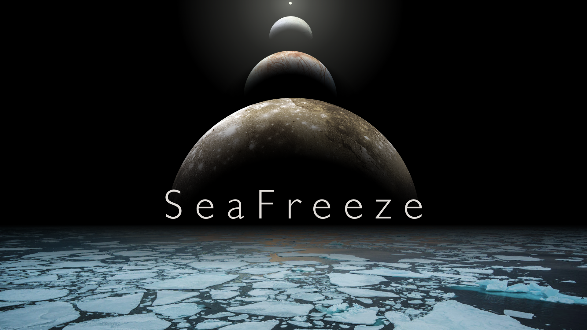
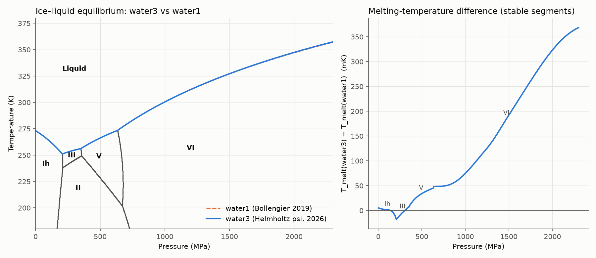
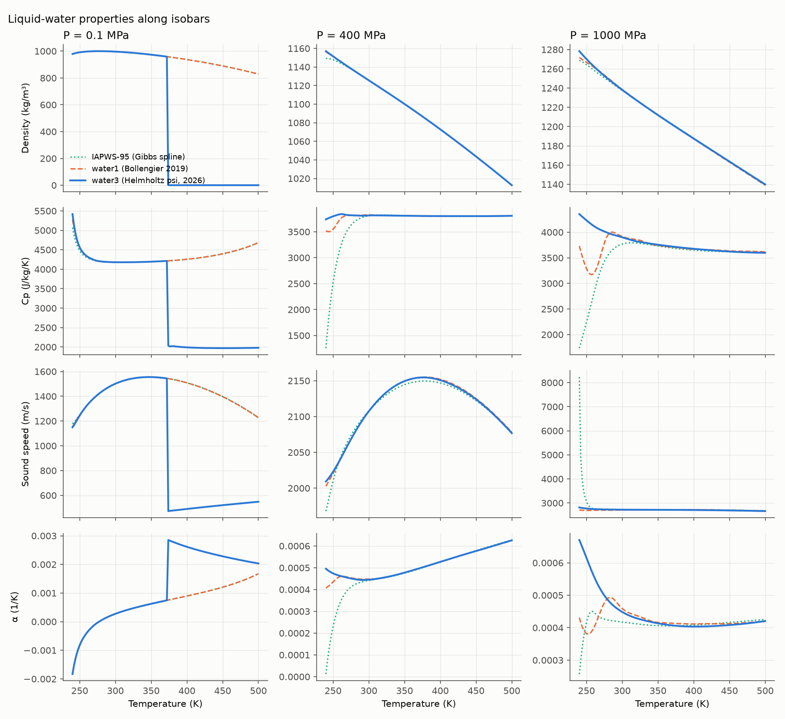
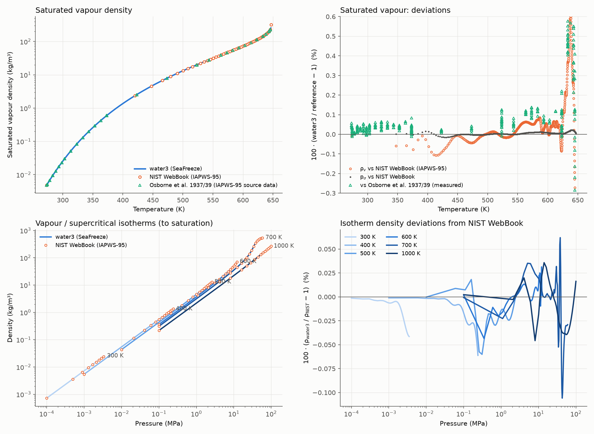
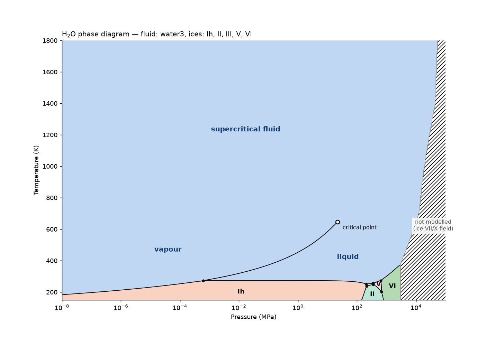
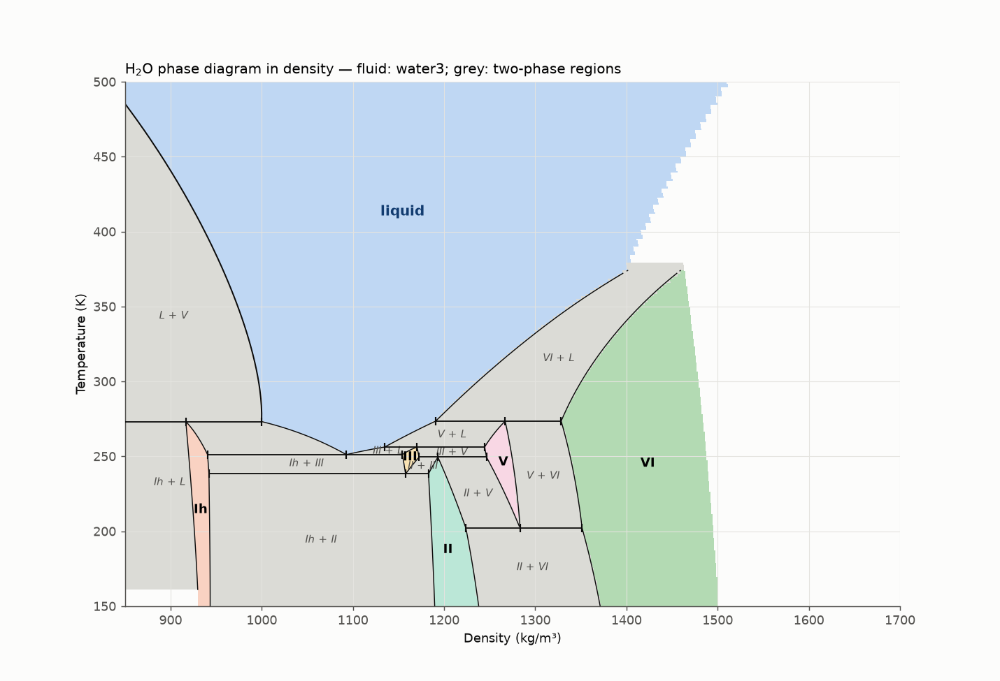
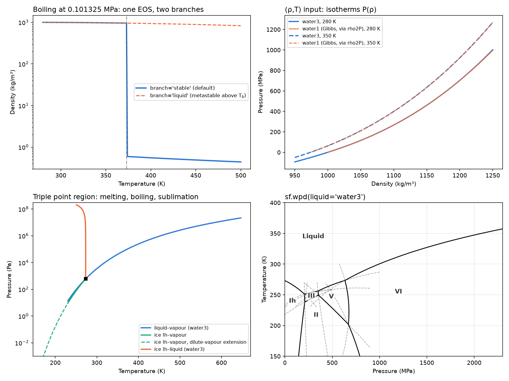
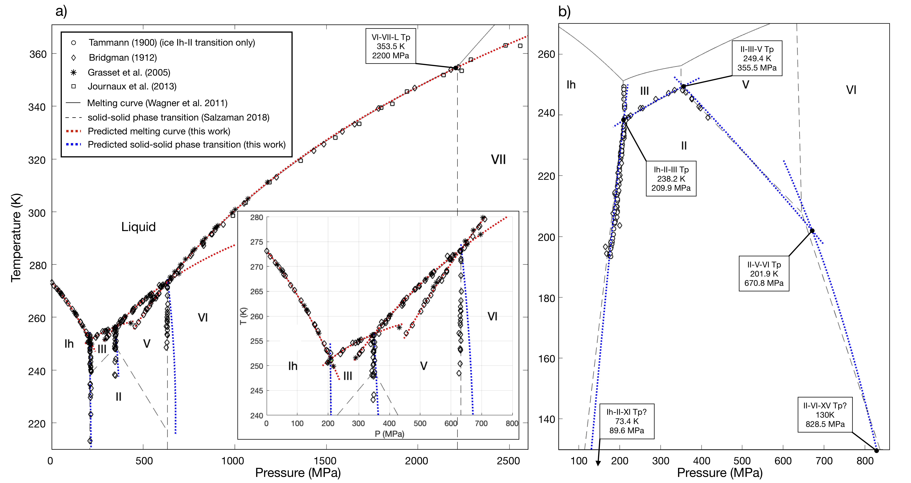

# SeaFreeze

[](https://opensource.org/license/gpl-3-0/)
[](https://twitter.com/B_jour)
[](https://github.com/Bjournaux)

V1.2 beta (Python `1.2.0b1`, Matlab `1.2.0-beta`)

<a href="https://bjournaux.wordpress.com/" target="_blank"></a>



> **🌊 Try SeaFreeze online:** [seafreeze.streamlit.app](https://seafreeze.streamlit.app/)
> ⚠️ *Beta version — the web GUI is under active development and may contain bugs. For production use, please install the Python or Matlab package directly.*

The SeaFreeze package allows to compute the thermodynamic and elastic properties of pure water, ice polymorphs (Ih, II, 
III, V, VI and ice VII/ice X) up to 100 GPa and 10,000 K and aqueous NaCl solutions up to 8 GPa and 2,000 K. It is based on 
the evaluation of Gibbs Local Basis Functions parametrization (https://github.com/jmichaelb/LocalBasisFunction) for each 
phase, constructed to reproduce thermodynamic measurements. The formalism is described in more details in 
[Journaux et al. (2020)](https://agupubs.onlinelibrary.wiley.com/doi/full/10.1029/2019JE006176), and in the liquid water 
Gibbs parametrization by [Bollengier, Brown, and Shaw (2019)](https://aip.scitation.org/doi/abs/10.1063/1.5097179). 
Aqueous NaCl equation of state publication is in preparation.

**New in 1.2 beta:** `water3`, fluid water (vapour, liquid, supercritical) from a Helmholtz energy surface F(ρ,T)
covering 230 K – 150 000 K and the dilute vapour to 16 000 kg/m³; density–temperature input for every material;
liquid–vapour and ice–vapour equilibria; and full phase diagrams in (P,T) and (ρ,T) with the vapour, the critical
point, the ices, the two-phase regions and the triple points. See
[New in 1.2 beta](#new-in-12-beta-water3-vapour-equilibria-and-full-phase-diagrams).

Both Python and Matlab versions are at 1.2 beta. The Matlab version also runs unmodified under GNU Octave.

Contact: bjournau (at) uw (dot) edu


## Getting Started


### Installing
Refer to the README file for each version (Python or Matlab) for installing SeaFreeze.


## Running SeaFreeze

This section provides basic examples on how to run SeaFreeze. It is using pseudocode, so syntax will change 
depending on the version used. 

### Inputs

**For Pure Water and ices**

To run the SeaFreeze function for ices and pure water you need to provide pressure (MPa) and temperature (K) coordinates and a material input:

```
out = SF_getprop(PT, 'material')
```

**For aqueous solutions**

For obtaining properties of an aqueous solution of a given concentration in mol/kg, you need to provide pressure (MPa), temperature (K) and concentration coordinates (mol/kg):

```
out = SF_getprop(PTm, 'material')
```


**For single properties**

To improve computational efficiency, a list of specified thermodynamic variables can be calculated by specifying them as inputs:

```
out = SF_getprop(PT, 'material', {'G', 'rho'})
```

**Density–temperature input and fluid branch** *(new in 1.2)*

```
out = SF_getprop(rhoT, 'material', props, 'input', 'rhoT')   % any material; P is returned
out = SF_getprop(PT, 'water3', props, 'branch', 'liquid')      % Helmholtz fluid: 'stable' | 'liquid' | 'vapor'
```

> **Note:** The legacy entry point `SeaFreeze(PT, 'material', ...)` still works as a deprecated alias for `SF_getprop`.
PT is a structure (gridded output) or array (scatter output) containing pressure-temperature points (MPa and Kelvin).

* 'material' defines which ice, water, or solution to use.  Possibilities:
* 'Ih' for ice Ih (Feistel and Wagner, 2006)
* 'II' for ice II (Journaux et al. 2020)
* 'III' for ice III (Journaux et al. 2020)
* 'V' for ice V (Journaux et al. 2020)
* 'VI' for ice VI (Journaux et al. 2020)
* 'VII_X_French' for ice VII and ice X (French and Redmer 2015)
* 'water1' for Bollengier et al. (2019) LBF extending to 500 K and 2300 MPa
* 'water2' for the modified EOS in Brown 2018 extending to 100 GPa and 10,000 K
* 'water_IAPWS95' for IAPWS95 water (Wagner and Pruss, 2002)
* 'water3' for fluid water — vapour, liquid and supercritical — from a Helmholtz energy surface F(ρ,T) (psi-spline stage5_18f, Brown & Journaux, lbf-thermo 2026), 230 K – 150 000 K, up to 16 000 kg/m³ (**new in 1.2**, see [New in 1.2 beta](#new-in-12-beta-water3-vapour-equilibria-and-full-phase-diagrams))
* 'NaClaq' for aqueous NaCl solution (Brown and Journaux et al., in prep.)


### Outputs
out is a structure containing all output quantities (SI units):


| Quantity  (PT and PTm)      |  Symbol in SeaFreeze  |  Unit (SI)  |
| --------------- |:---------------------:| :----------:|
| Gibbs Energy           | `G` | J/kg |
| Entropy                | `S` | J/K/kg |
| Internal Energy        | `U` | J/kg |
| Enthalpy               | `H` | J/kg |
| Helmholtz free energy  | `A` | J/kg |
| Density                |`rho`| kg/m^3 |
|Specific heat capacity at constant pressure|`Cp`| J/kg/K |
|Specific heat capacity at constant volume|`Cv`| J/kg/K |
| Isothermal bulk modulus      |`Kt`| MPa |
|Pressure derivative of the Isothermal bulk modulus|`Kp`| - |
| Isoentropic bulk modulus     |`Ks`| MPa |
| Thermal expansivity     |`alpha`| /K |
| Shear modulus (only for solids)    |`shear`| MPa |
| P wave velocity (only for solids)     |`Vp`| m/s |
| S wave velocity (only for solids)     |`Vs`| m/s |
| Bulk sound speed     |`vel`| m/s |
| Joule-Thomson coefficient |`Js`| K/MPa |
| Grüneisen parameter  |`gamma_Gruneisen`| - |


| Quantity  (PTm only)      |  Symbol in SeaFreeze  |  Unit (SI)  |
| --------------- |:---------------------:| :----------:|
| Solute Chemical Potential           | `mus` | J/mol |
| Solvent Chemical Potential                | `muw` | J/mol |
| Partial Molar Volume        | `Vm` | cc/mol |
| Partial Molar Heat Capacity               | `Cpm` | J/kg/K/mol |
| Apparent Heat Capacity  | `Cpa` | J/kg/K/mol |
| Apparent Volume                |`Va`| cc/mol |
|Excess Volume|`Vex`| cc/mol |
|Osmotic Coefficient|`phi`| -|
| Water Activity      |`aw`| - |


 **NaN values returned when out of parametrization boundaries.**


## Examples for pure compound (pure water and ices)

An executable Matlab live script (Matlab/examples/SeaFreeze_examples.mlx) is provided allowing to run the following examples.

### Single point input

Single point for ice VI at 900 MPa and 255 K. This can be used to check returned thermodynamic properties values.
```Matlab
PT = {900,255};
out = SF_getprop(PT, 'VI')
```
Output :
```Matlab
out = 

  struct with fields:

      rho: 1.3561e+03
       Cp: 2.0054e+03
        G: 7.4677e+05
       Cv: 1.8762e+03
      vel: 3.6759e+03
       Kt: 1.7143e+04
       Ks: 1.8323e+04
       Kp: 6.2751
        S: -1.3827e+03
        U: -2.6951e+05
        H: 8.3090e+04
    alpha: 2.0020e-04
       Vp: 4.5490e+03
       Vs: 2.3207e+03
    shear: 7.3033e+03
```

### Grid  input
Grid of points for ice V every 2 MPa from 400 to 500 MPa and every 0.5 K from 220 to 250 K
```Matlab
PT = {400:2:500,240:0.5:250};
out = SF_getprop(PT, 'V')
```
Output :
```Matlab
out = 

  struct with fields:

      rho: [51×21 double]
       Cp: [51×21 double]
        G: [51×21 double]
       Cv: [51×21 double]
      vel: [51×21 double]
       Kt: [51×21 double]
       Ks: [51×21 double]
       Kp: [51×21 double]
        S: [51×21 double]
        U: [51×21 double]
        H: [51×21 double]
    alpha: [51×21 double]
       Vp: [51×21 double]
       Vs: [51×21 double]
    shear: [51×21 double]
```


### List  input
List of 3 points for liquid water at 300K and 200, 223 and 225 MPa 
```Matlab
PT = ([200 300 ; 223 300 ; 225 300 ]);
out = SF_getprop(PT, 'water1')
```

```Matlab
out = 

  struct with fields:

      rho: [3×1 double]
       Cp: [3×1 double]
        G: [3×1 double]
       Cv: [3×1 double]
      vel: [3×1 double]
       Kt: [3×1 double]
       Ks: [3×1 double]
       Kp: [3×1 double]
        S: [3×1 double]
        U: [3×1 double]
        H: [3×1 double]
    alpha: [3×1 double]
```
## Example for Solutions

Thermodynamic properties can be calculated for solutions of varying molality as well, where the input provides pressure (MPa), temperature (K), and molality (mol/kg) coordinates over a grid or list, or for a single point. 

### Single point input

Single point for NaCl(aq) of 0.5 M at 900 MPa and 280 K:

```Matlab
PTm = {900, 280, 0.5};
out = SF_getprop(PTm, 'NaClaq')
```
Output :

```Matlab
out = 

  struct with fields:

           G: 7.7725e+05
           S: -143.0425
           U: 1.7738e+04
           H: 7.3720e+05
           A: 5.7790e+04
         rho: 1.2509e+03
          Cp: 3.7630e+03
          Cv: 3.3825e+03
          Kt: 7.7225e+03
          Ks: 8.5913e+03
          Kp: 5.7676
       alpha: 4.6921e-04
         vel: 2.6207e+03
          Va: 24.7939
         Cpa: 124.5329
         mus: 1.7721e+04
         muw: 1.4252e+04
          Vm: 24.3212
          Vw: 14.6032
         Cpm: 149.3719
         phi: 0.8174
         Vex: 0.2598
          aw: 0.9854
```

### Grid input

Grid of points every 10 MPa from 0.1 to 1000 MPa, every 2 K from 240 to 501 K, and every 0.5 M from 1 to 6 mol/kg:

```Matlab
PTm = {0.1:10:1000.2,240:2:501,1:0.5:6}; 
out = SF_getprop(PTm, 'NaClaq')
```

Output :

```Matlab

      out = 

  struct with fields:

           G: [101×131×11 double]
           S: [101×131×11 double]
           U: [101×131×11 double]
           H: [101×131×11 double]
           A: [101×131×11 double]
         rho: [101×131×11 double]
          Cp: [101×131×11 double]
          Cv: [101×131×11 double]
          Kt: [101×131×11 double]
          Ks: [101×131×11 double]
          Kp: [101×131×11 double]
       alpha: [101×131×11 double]
         vel: [101×131×11 double]
          Va: [101×131×11 double]
         Cpa: [101×131×11 double]
         mus: [101×131×11 double]
         muw: [101×131×11 double]
          Vm: [101×131×11 double]
          Vw: [101×131×11 double]
         Cpm: [101×131×11 double]
         phi: [101×131×11 double]
         Vex: [101×131×11 double]
          aw: [101×131×11 double]

```

## New in 1.2 beta: `water3`, vapour equilibria and full phase diagrams

### `water3`: Helmholtz-energy fluid water

`water3` is fluid water — vapour, liquid and supercritical fluid — from a Helmholtz energy surface F(ρ,T): the
psi-spline surface *stage5_18f* (J. M. Brown & B. Journaux, lbf-thermo 2026). Unlike the other SeaFreeze phases it is
not a Gibbs spline G(P,T): the residual Helmholtz energy is a tensor B-spline in (ln ρ, ln T) plus analytic ideal-gas,
reacting-mixture, critical (KW2000) and low-temperature two-structure terms. It shares the IAPWS-95 reference state
with the ice splines, so it can be used with them for phase equilibria. At (P,T) SeaFreeze solves P = ρ²∂F/∂ρ for the
density and returns the **stable** branch (vapour below the saturation pressure, liquid above); the `branch` option
returns the metastable liquid or vapour instead.

**Range of validity**

| | water3 range |
|---|---|
| Temperature | 230 K – 150 000 K (surface knots). Below 230 K only the dilute vapour is available, through the ideal-gas extension used by the sublimation curve and the phase diagrams |
| Density | up to 16 000 kg/m³; below 10⁻⁴ kg/m³ the surface is continued by a virial form and a low-density chemistry table |
| Pressure | from the dilute vapour to ~10 TPa (P = ρ²∂F/∂ρ over the box) |
| Phases | vapour, liquid, supercritical fluid; at (P,T) the stable branch (lower Gibbs energy) is returned unless `branch` = `'liquid'` / `'vapor'` |
| Not water | more than 40 K below the melting curve of the stable solid (the surface's own validity mask, psiEOS `dq2026` model); the phase diagrams apply this mask |
| Use with care | cold ultra-dense corner (ρ > 4000 kg/m³, T < 1000 K: not constrained by data); interior of the two-phase dome (spinodals are data-free; small (∂P/∂ρ)_T loops near T_c make the saturated-liquid density step by ~10 kg/m³ near 637 K); supercooled liquid below 230 K and stretched liquid below −140 MPa are extrapolations |

**Accuracy**

| Check | Result |
|---|---|
| Ambient liquid (0.101325 MPa, 298.15 K) | ρ = 997.047 kg/m³, Cp = 4181.5 J/kg/K, sound speed 1496.7 m/s |
| Evaluator vs the reference implementation (psiH2O_val, lbf-thermo) | 1e-13 (Matlab), 1e-11 (Python) relative |
| Vapour pressure vs IAPWS-95 (273.16–646.5 K) | within 0.02 % (0.005 % below 620 K); p_σ(373.124 K) = 0.101323 MPa |
| Saturated-vapour density vs NIST WebBook | within ~0.1 % to 620 K |
| Vapour / supercritical isotherms 300–1000 K vs NIST WebBook | within 0.1 % |
| Ice Ih sublimation (water3 vapour + ice Ih) vs IAPWS R14-08 | within ±0.008 % over 230–273.16 K |
| Ice Ih sublimation vs NIST measurements (Bielska et al. 2013, 175–253 K) | every point within 3σ (dilute-vapour extension below 230 K) |
| Ice–liquid curves vs `water1` | within 0.05 K up to 632 MPa (Ih, III, V); 0.4 K along ice VI to 2.3 GPa; Ih melting at 0.101325 MPa = 273.158 K |
| Triple points | within 0.07 K of the literature values; Ih–liquid–vapour at 273.1654 K, 611.9 Pa |
| Stable liquid vs `water1` (240–500 K, ≤ 2.3 GPa) | ρ rms 0.05 % (max 0.12 %), Cp rms 0.8 % |




**Evaluating `water3`**

```matlab
% Matlab / Octave
out = SF_getprop([0.101325 298.15; 1e-3 300], 'water3');      % liquid, then vapour: out.rho = [997.047; 0.00722]
out = SF_getprop([1e-3 300], 'water3', {'rho','G'}, 'branch', 'liquid');   % superheated liquid
```
```python
# Python
import numpy as np, seafreeze as sf
from seafreeze.seafreeze import defpath
PT = np.empty(2, dtype=object); PT[0] = (0.101325, 298.15); PT[1] = (1e-3, 300.0)
out = sf.getProp(PT, 'water3')                                   # out.rho = [997.047, 0.00722]
out = sf.getProp(PT[1:], 'water3', defpath, 'rho', 'G', branch='liquid')
```

### Density–temperature input (all materials)

Every material accepts (ρ,T) — or (ρ,T,m) for NaClaq — points and returns P. `water3` is evaluated directly; the
Gibbs splines first solve P(ρ,T) with `SF_rho2P` / `rho2P` (1e-6 MPa).

```matlab
out = SF_getprop([1000 300; 1100 300], 'water3', {'P','Cp'}, 'input', 'rhoT');   % out.P = [7.833; 299.53] MPa
out = SF_getprop([1330 260], 'VI', {'P','Vp'}, 'input', 'rhoT');
out = SF_getprop([1050 300 1.0], 'NaClaq', {'P','muw'}, 'input', 'rhoT');
```
```python
rT = np.empty(2, dtype=object); rT[0] = (1000.0, 300.0); rT[1] = (1100.0, 300.0)
out = sf.getProp(rT, 'water3', defpath, 'P', 'Cp', rhoT=True)
out = sf.getProp(rT, 'water1', defpath, 'P', 'Cp', rhoT=True)
```

### Vapour equilibria: saturation and sublimation

Liquid–vapour and ice–vapour coexistence are solved as G_A = G_B by Newton iteration in ln P. Below 230 K (the lowest
temperature of water3) the sublimation curve uses a **dilute-vapour extension** (the surface's ideal-gas part; changes
p_sub by ~1e-5 relative at those < 10 Pa pressures). It is on by default and warns once per session; switch it off to
get NaN below 230 K.

```matlab
sat = SF_coexistence('saturation', linspace(273.16, 646.5, 200));   % sat.P, sat.rho_A (liquid), sat.rho_B (vapour)
sub = SF_coexistence('sublimation', linspace(170, 273.16, 150));    % ice Ih - vapour
sub = SF_coexistence('sublimation', 200, 'dilute_extension', false);
```
```python
sat = sf.saturation(np.linspace(273.16, 646.5, 200))   # Coexistence(P, T, rho_A, rho_B)
sub = sf.sublimation(np.linspace(170, 273.16, 150))
sub = sf.sublimation([200.0], dilute_extension=False)
```




### Full phase diagrams in (P,T) and (ρ,T)

The whole H₂O phase diagram — vapour, liquid, supercritical fluid, the critical point and the ices — by Gibbs-energy
minimisation over `water3` and the ices (default Ih, II, III, V, VI; ice VII/X is left out until an updated model is
available). Boundaries are the G_i = G_j contours between neighbouring stable phases; triple points are refined by
Newton on G_a = G_b = G_c (within 0.07 K of the literature values). In (ρ,T) the density gaps between coexisting
phases are the two-phase regions (grey), separated by the three-phase tie lines through the triple points. Cells with
no available phase (the ice VII/X field) are marked *not modelled*.

```matlab
SF_WPD_PT()                                                                         % log P, 150-1800 K
SF_WPD_rhoT()                                                                       % log density
SF_WPD_rhoT('rho', [850 1700], 'T', [150 500], 'P', [1e-10 1e4], 'xscale', 'linear')   % zoom on the ices
```
```python
sf.wpd_PT()
sf.wpd_rhoT()
sf.wpd_rhoT(rho=(850, 1700), T=(150, 500), P=(1e-10, 1e4), xscale='linear')
pm = sf.phase_map(np.geomspace(1e-9, 3e3, 400), np.linspace(180, 420, 200)); sf.triple_points(pm)
```





Typical run times:

| Default call | Python | Matlab |
|---|---|---|
| (P,T) diagram (`wpd_PT` / `SF_WPD_PT`) | ~10 s | ~35 s |
| (ρ,T) diagram, log density (`wpd_rhoT` / `SF_WPD_rhoT`) | ~16 s | ~55 s |
| (ρ,T) dense zoom (850–1700 kg/m³, 150–500 K) | ~19 s | ~75 s |

Measured on an Apple-silicon Mac (Matlab R2025b Intel build under Rosetta); times scale with the grid size (`nP`, `nT`) and depend on the machine. The Matlab functions issue a `SeaFreeze:longRuntime` warning at start.

### `water3` as the liquid in the phase-boundary tools

```matlab
SF_WhichPhase({P, T}, 'liquid', 'water3');   SF_PhaseLines('Ih', 'water3');   SF_WPD('liquid', 'water3');
```
```python
sf.whichphase(PT, 'water3');   sf.phase_lines('Ih', 'water3');   sf.wpd(liquid='water3')
```

### Tutorials

[`Python/examples/water3_tutorial.py`](Python/examples/water3_tutorial.py) and
[`Matlab/examples/water3_tutorial.m`](Matlab/examples/water3_tutorial.m) run all of the above end to end.
The Python and Matlab READMEs document every option.




## Utility functions

- **`SF_WhichPhase` / `whichphase`** — Determine which phase is thermodynamically stable at given (P,T) coordinates. Supports NaCl(aq) for freezing-point depression, and `water3` as the liquid (1.2).
- **`SF_PhaseLines`** — Compute the equilibrium curve between any two phases by zero-contouring the Gibbs energy difference. Returns (P,T) coordinates with stable/metastable classification.
- **`SF_WPD` / `wpd`** — Plot the H2O phase diagram of the ices with optional NaCl(aq) melting-curve overlays, metastable extensions, phase-field labels, and `water3` melting curves (1.2).
- **`SF_WPD_PT` / `wpd_PT`**, **`SF_WPD_rhoT` / `wpd_rhoT`** *(1.2)* — Full phase diagram with vapour, liquid, supercritical fluid, critical point and ices, in (P,T) or (ρ,T) with two-phase regions and triple-point tie lines; the data come from `sf_phase_map` / `phase_map` and `sf_triple_points` / `triple_points`.
- **`SF_rho2P` / `rho2P`** — Invert the EOS: given a target density (kg/m³) and temperature (K), return the pressure (MPa) for any supported material. Uses Newton-Raphson with isothermal bulk modulus Kt and a bisection fallback. Returns NaN where no solution exists within the phase's domain. For 'water3' P = ρ²∂F/∂ρ is evaluated directly.
- **`SF_coexistence` / `saturation`, `sublimation`** *(1.2)* — Liquid–vapour (vapour pressure) and ice–vapour (sublimation) curves from the Helmholtz fluid 'water3', solved as G_A = G_B by Newton iteration in ln P; dilute-vapour extension below 230 K (on by default).

See the Python and Matlab READMEs for full documentation and usage examples.

## Important remarks 
### Water representations
The ices' Gibbs parametrizations are optimized to be used with 'water1' Gibbs LBF from Bollengier et al. (2019), 
specially for phase equilibrium calculation. Using other water parametrization wil lead to incorrect melting curves. 
'water2' (Brown 2018) and 'water_IAPWS95' (IAPWS95) parametrization are provided for HP extension (up to 100 GPa) and 
comparison only. The authors recommend the use of 'water1' (Bollengier et al. 2019) for any application in the 200-355 K 
range and up to 2300 MPa.

'water3' (1.2 beta) is a Helmholtz energy F(ρ,T) surface rather than a Gibbs spline. It shares the IAPWS-95 reference state with the ice splines and reproduces the 'water1' melting curves within 0.05 K up to 632 MPa; it is the phase to use for vapour, liquid–vapour and supercritical states. See its [range of validity and accuracy](#water3-helmholtz-energy-fluid-water).

A Gibbs energy representation of French and Redmer (2015) ice VII and X equation of state is included. The VII/X–water melting curve is stable above the VI–VII–water triple point (~2216 MPa, 354 K).

### Range of validity
SeaFreeze stability prediction is currently considered valid down to 130K, which correspond to the ice VI - ice XV transition. The ice Ih - II transition is potentially valid down to 73.4 K (ice Ih - ice XI transition).


The following figure shows the prediction of phase transitions from SeaFreeze (melting & solid-solid) and comparison with experimental data:



## Reference to cite to use SeaFreeze:
- [Journaux et al. (2020) JGR Planets 125(1), e2019JE006176 ](https://agupubs.onlinelibrary.wiley.com/doi/abs/10.1029/2019JE006176)

## References for the liquid water equations of states used:
- [Bollengier, Brown and Shaw (2019) J. Chem. Phys. 151, 054501; doi: 10.1063/1.5097179](https://aip.scitation.org/doi/abs/10.1063/1.5097179)
- [Brown (2018) Fluid Phase Equilibria 463, pp. 18-31](https://www.sciencedirect.com/science/article/pii/S0378381218300530)
- [Feistel and Wagner (2006), J. Phys. Chem. Ref. Data 35, pp. 1021-1047](https://aip.scitation.org/doi/abs/10.1063/1.2183324)
- [Wagner and Pruss (2002), J. Phys. Chem. Ref. Data 31, pp. 387-535](https://aip.scitation.org/doi/abs/10.1063/1.1461829)
- [French and Redmer (2015), Physical Review B 91, 014308](http://link.aps.org/doi/10.1103/PhysRevB.91.014308)
- water3: psi-spline Helmholtz surface stage5_18f, J. M. Brown & B. Journaux (lbf-thermo, 2026), in prep.
- [Wagner, Riethmann, Feistel & Harvey (2011) J. Phys. Chem. Ref. Data 40, 043103](https://doi.org/10.1063/1.3657937) (IAPWS R14-08 sublimation and melting pressures)
- [Bielska et al. (2013) Geophys. Res. Lett. 40, 6303–6307](https://doi.org/10.1002/2013GL058474) (NIST ice vapour-pressure measurements)

## Contributors

* **Baptiste Journaux (Lead)** - *University of Washington, Earth and Space Sciences Department, Seattle, USA* 
* **J. Michael Brown** - *University of Washington, Earth and Space Sciences Department, Seattle, USA* 
* **Penny Espinoza** - *University of Washington, Earth and Space Sciences Department, Seattle, USA*
* **Ula Jones** - *University of Washington, Earth and Space Sciences Department, Seattle, USA*
* **Erica Clinton** - *University of Washington, Earth and Space Sciences Department, Seattle, USA*  
* **Tyler Gordon** - *University of Washington, Department of Astronomy, Seattle, USA*
* **Matthew J. Powell-Palm** - *Texas A&M University, Department of Mechanical Engineering, USA*
* **Steven D. Vance** - *NASA Jet Propulsion Laboratory, California Institute of Technology, Pasadena, USA*

## Change log

### Changes since 0.9.0
- `1.2 beta` (Python `1.2.0b1`, Matlab `1.2.0-beta`): Added 'water3', a Helmholtz energy F(ρ,T) fluid (psi-spline surface) evaluated by `fnFval`/`psi_val` (Matlab) and `lbftd.evalHelmholtz` (Python), with stable / liquid / vapour branch selection; (ρ,T) input for every material; `SF_coexistence` / `saturation`, `sublimation` with a dilute-vapour extension (on by default); full phase diagrams `SF_WPD_PT`/`wpd_PT` and `SF_WPD_rhoT`/`wpd_rhoT` with triple points; `water3` as the liquid in `SF_WhichPhase`/`whichphase`, `SF_PhaseLines`/`phase_lines` and `SF_WPD`/`wpd`; the Matlab sources run under GNU Octave; in-memory spline cache. Fixed equal-length P/T grids in `lbftd` and equal-length knot vectors in `mlbspline`.
- `1.1.3`: Added `SF_rho2P` (Matlab) and `rho2P` (Python) — EOS pressure-from-density inversion via Newton-Raphson + bisection fallback, supporting all materials including NaClaq. Fixed low-pressure convergence for all ice phases (Ih, II, III, V, VI) by separating the Newton/bisection domain floor from the initial-guess seed point.
- `1.1.2`: Fixed bug in `_get_shear_mod_GPa` where temperature was not cast to a numpy array, causing `np.sqrt` to fail on 2-D grid inputs for solid phases (ice Ih, II, III, V, VI, VII/X). All shear-wave properties (`shear`, `Vp`, `Vs`) on grids now compute correctly.
- `1.1.1`: Added `matplotlib` to Python dependencies; removed `numpy<2` upper bound for NumPy 2.x compatibility.
- `1.1.0`: New entry point `SF_getprop` (replaces `SeaFreeze`). Added `Js`, `gamma_Gruneisen` outputs. Removed `gam`, `Gex` outputs. Dynamic phase diagram `SF_WPD` replaces static WPD.mat. Rewritten `SF_PhaseLines` with 28 supported pairs including ice VII/X melting curves. Material name `aq_NaCl` renamed to `NaClaq`. No Curve Fitting Toolbox required.
- `1.0.2`: Fixed output for phaseline now coherent with the rest of the code as (P,T), bug fix with ice II-VI transition
- `1.0.1`: updated and improved  NaCl aqueous solution EOS and concentration dependent thermodynamic variables. Reasonable stability for conditions in ocean worlds including Earth's crust.  NaN returned for values outside the range of the representation.
- `1.0.0`: added NaCl aqueous solution EOS and concentration dependent thermodynamic variables.  NaN returned for values outside the range of the representation.
- `0.9.4`: add ice VII and ice X from French and Redmer (2015).
- [SeaFreeze GUI](https://github.com/Bjournaux/SeaFreeze/tree/master/SeaFreezeGUI) available
- `0.9.4`: Adjusted python readme syntax and package authorship info 
- `0.9.3`: LocalBasisFunction spline interpretation software integrated into SeaFreeze Python package. Adjusted packaging to work better with pip
- `0.9.2` patch1: added `SF_WPD`, `SF_PhaseLines` and `SeaFreeze_version` to the Matlab distribution.
- `0.9.2`: add ice II to the representation.
- `0.9.1`: add `whichphase` function to show which phase is stable at a PT coordinate.

### Planned updates
- MgSO4, Na2SO4 and MgCl2 aqueous solutions
- NH3 aqueous solutions
- NaCl-bearing solids (halite and hydrohalite)


## License

SeaFreeze is licensed under the GPL-3 License :

Copyright (c) 2019, B. Journaux

This program is free software: you can redistribute it and/or modify
    it under the terms of the GNU General Public License as published by
    the Free Software Foundation, version 3.
    
This program is distributed in the hope that it will be useful,
    but WITHOUT ANY WARRANTY; without even the implied warranty of
    MERCHANTABILITY or FITNESS FOR A PARTICULAR PURPOSE.  See the
    GNU General Public License for more details.

 You should have received a copy of the GNU General Public License
    along with this program.  If not, see <https://www.gnu.org/licenses/>.

THERE IS NO WARRANTY FOR THE PROGRAM, TO THE EXTENT PERMITTED BY
APPLICABLE LAW.  EXCEPT WHEN OTHERWISE STATED IN WRITING THE COPYRIGHT
HOLDERS AND/OR OTHER PARTIES PROVIDE THE PROGRAM "AS IS" WITHOUT WARRANTY
OF ANY KIND, EITHER EXPRESSED OR IMPLIED, INCLUDING, BUT NOT LIMITED TO,
THE IMPLIED WARRANTIES OF MERCHANTABILITY AND FITNESS FOR A PARTICULAR
PURPOSE.  THE ENTIRE RISK AS TO THE QUALITY AND PERFORMANCE OF THE PROGRAM
IS WITH YOU.  SHOULD THE PROGRAM PROVE DEFECTIVE, YOU ASSUME THE COST OF
ALL NECESSARY SERVICING, REPAIR OR CORRECTION.

## Acknowledgments

As of V1.1.0, SeaFreeze incorporates the mlbspline and lbftd packages originally developed by J. Michael Brown. Historical versions of these packages are no longer being updated and are available at https://github.com/jmichaelb/LocalBasisFunction. 

This work was produced with the financial support provided by the NASA Postdoctoral Program fellowship, by the NASA Solar System Workings Grant 80NSSC17K0775 and by the Icy Worlds node of NASA's Astrobiology Institute (08-NAI5-0021).

Illustration montage uses pictures from NASA Galileo and Cassini spacecrafts (from top to bottom: Enceladus, Europa and Ganymede). Terrestrial sea ice picture use with the authorization of the author [Rowan Romeyn](https://arcex.no/meet-rowan-romeyn-a-new-arcex-phd-student/).
