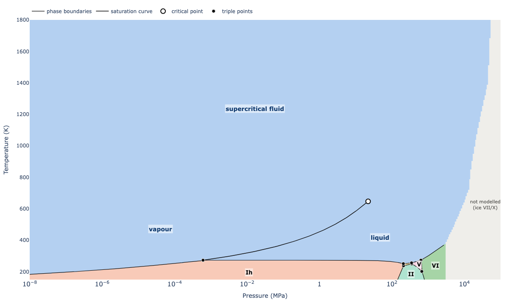
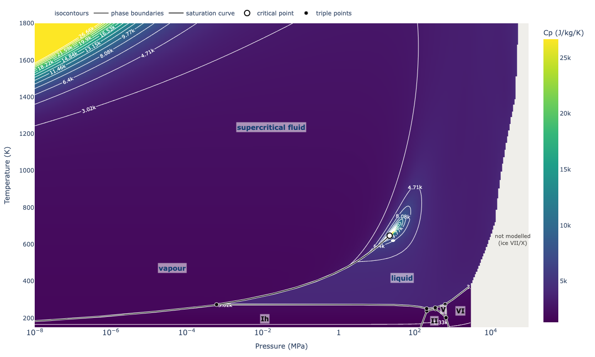
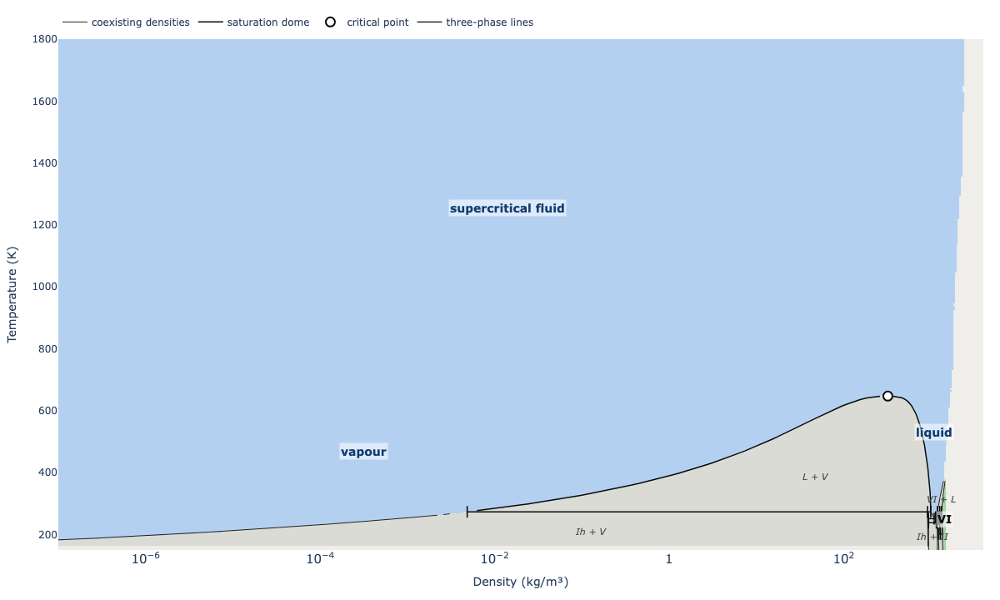
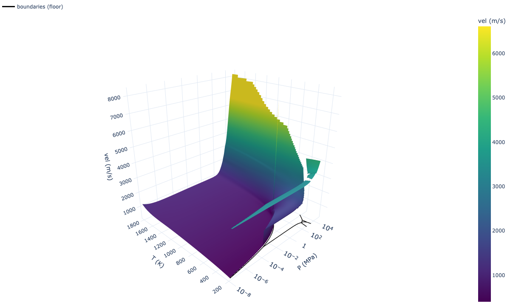

# SeaFreeze GUI

Interactive web and desktop application for computing thermodynamic properties of water, ice polymorphs, and NaCl aqueous solutions using [SeaFreeze](https://github.com/Bjournaux/SeaFreeze).

Built with [Streamlit](https://streamlit.io/) and [Plotly](https://plotly.com/python/).

---

## Features

### Property Calculator

Compute thermodynamic properties for any SeaFreeze material (Ice Ih–VII/X, Water, NaCl(aq), and **water_Brown2026**, the 1.2-beta Helmholtz fluid: vapour, liquid and supercritical) with adaptive visualization that adjusts to your input:

- **Single point** — returns a table of all properties with values and units
- **1-D sweep** — vary one coordinate (P, ρ, T, or m) to produce interactive line plots
- **2-D grid** — vary two coordinates to produce heatmaps, heatmaps with isocontours, or 3-D surface plots

Input in **(P, T)** or **(ρ, T)** for every pure phase (the pressure is then an output; native for water_Brown2026, solved point by point for the Gibbs phases, so those grids are capped at 2500 points). For water_Brown2026 at (P, T) choose the **branch**: stable (lower Gibbs energy), liquid or vapour. Every P, ρ and T range can be **log-spaced** and drawn on a log axis, and 1-D plots have a log y-axis option.

All modes support CSV export. The 2-D mode includes selectable color scales, adjustable contour density, and optional stability field boundary overlays (for water_Brown2026: the full phase diagram — boundaries, saturation curve, critical and triple points).

| Single point | 1-D sweep |
|:---:|:---:|
|  |  |

| Heatmap | Heatmap + Isocontours | 3-D Surface |
|:---:|:---:|:---:|
|  |  |  |

### Phase Diagram — full diagram (water_Brown2026 + ices)

The whole H₂O phase diagram — vapour, liquid, supercritical fluid, the critical point and ices Ih, II, III, V, VI — by Gibbs-energy minimisation (`seafreeze.phase_diagram_PT` / `phase_diagram_rhoT`), in **P–T** or **ρ–T**:

- **Colour by** the stable phase, or by any property of the stable phase (ρ, P, G, S, U, H, A, Cp, Cv, K_T, K′, K_S, α, sound speed, isentropic dT/dP, Grüneisen; shear, Vp, Vs in the ices) — the map jumps across every phase boundary
- **Views**: 2-D map, 2-D map + isocontours, 3-D surface (opened along the phase boundaries)
- **Overlays**: phase boundaries (ρ–T: coexisting densities), saturation curve / dome, critical point, triple points (ρ–T: three-phase tie lines), field labels; two-phase regions shaded grey in ρ–T
- **Axes**: log or linear P / ρ and T; colour range 1–99 % (default), full or manual; log colour scale
- **Range & resolution**: the default window (P 1e-8–1e5 MPa, ρ 1e-7–4000 kg/m³, T 150–1800 K) loads instantly from `assets/diagrams/`; other windows and the Draft / Standard / Fine resolutions are computed live (≈ 8–26 s, shown before you run) and cached
- Triple-point / critical-point table and CSV export of the displayed grid

Ice VII/X is not included yet (a new representation is in preparation); its field is shown as *not modelled*.

| Stable phase (P–T) | Cp of the stable phase, isocontours |
|:---:|:---:|
|  |  |

| Stable phase (ρ–T, log density) | Sound speed, 3-D surface |
|:---:|:---:|
|  |  |

After changing the SeaFreeze library or the default window/resolution, regenerate the shipped defaults with `python3 tools/precompute_diagrams.py` (the app recomputes live if they do not match).

### Phase Diagram — ice melting lines

Interactive water phase diagram with selectable phase boundaries:

- Checkboxes for each ice polymorph (Ih, II, III, V, VI) and liquid water; liquid **water_Bollengier2019** or **water_Brown2026**
- Log or linear P and T axes
- Toggle between stable, metastable, or all segments
- Overlay NaCl(aq) melting curves at user-specified molalities
- Adjustable P and T axis ranges
- CSV export of all displayed boundary data

| Pure water phase diagram | With NaCl(aq) melting curves |
|:---:|:---:|
|  |  |

---

## Quick Start (Web App)

### Requirements

- Python 3.10+
- pip

### Install and run

```bash
# Clone the repository
git clone https://github.com/Bjournaux/SeaFreeze.git
cd SeaFreeze/SeaFreezeGUI

# Install dependencies
pip install -r requirements.txt

# Launch the app
streamlit run app.py
```

The app opens in your browser at `http://localhost:8501`.

When run from a repository checkout, the app uses the in-repo SeaFreeze library (`../Python`) ahead of any installed copy.

### Dependencies

| Package | Version |
|---------|---------|
| SeaFreeze | >= 1.1.1 |
| Streamlit | >= 1.39 |
| Plotly | >= 5.20 |
| Pandas | >= 2.1 |
| NumPy | >= 1.26 |

---

## Building the Desktop App (macOS Apple Silicon)

The desktop app bundles the full Python interpreter and all dependencies into a standalone `.app` — no Python installation needed on the target machine.

### Prerequisites

```bash
pip install pyinstaller
```

### Build

```bash
cd SeaFreezeGUI
python -m PyInstaller SeaFreezeGUI.spec --noconfirm
```

The output is at `dist/SeaFreezeGUI.app` (~335 MB). Double-click to launch — it starts a local Streamlit server and opens your browser automatically.

### Notes

- **First launch on macOS:** The app is unsigned, so Gatekeeper will block it. Right-click the `.app` and select "Open" to bypass, or sign it with an Apple Developer certificate.
- **Rebuilding after changes:** Delete `build/` and `dist/`, then re-run the PyInstaller command.
- The build spec (`SeaFreezeGUI.spec`) is pre-configured for ARM64 (Apple Silicon). For Intel Macs, change `target_arch` to `"x86_64"`.

---

## Project Structure

```
SeaFreezeGUI/
├── app.py                  # Entry point: page config, sidebar branding, navigation
├── launcher.py             # Desktop launcher (starts Streamlit in-process)
├── SeaFreezeGUI.spec       # PyInstaller build specification
├── requirements.txt        # Python dependencies
├── core/
│   ├── __init__.py
│   ├── compute.py          # Cached wrappers around SeaFreeze API
│   ├── constants.py        # Material lists, property metadata, categories, input limits
│   ├── diagrams.py         # Full phase diagrams: precomputed defaults + cached live runs
│   ├── diagram_plot.py     # Plotly drawing of the diagrams and property maps (2-D / 3-D)
│   └── ui.py               # Shared UI helpers (labels, CSV export, boundary overlays)
├── views/                  # One module per page, each exposing render()
│   ├── property_calculator.py
│   ├── phase_diagram.py    # mode switch + ice melting-line viewer
│   ├── full_diagram.py     # full diagram / property maps
│   └── about.py
├── tools/
│   └── precompute_diagrams.py   # regenerates assets/diagrams/*.npz
├── tests/
│   └── test_app.py         # AppTest smoke tests: cd SeaFreezeGUI && python3 -m pytest -q tests
├── .streamlit/
│   └── config.toml         # Streamlit theme and server config
├── screenshots/            # App screenshots for documentation
└── assets/                 # Icons, static assets, diagrams/ (precomputed default diagrams)
```

---

## Citation

If you use SeaFreeze in your research, please cite:

Journaux et al. (2020). Holistic Approach for Studying Planetary Hydrospheres: Gibbs Representation of Ices Thermodynamics, Elasticity, and the Water Phase Diagram to 2300 MPa. *Journal of Geophysical Research: Planets*, 125, e2019JE006176. https://doi.org/10.1029/2019JE006176
